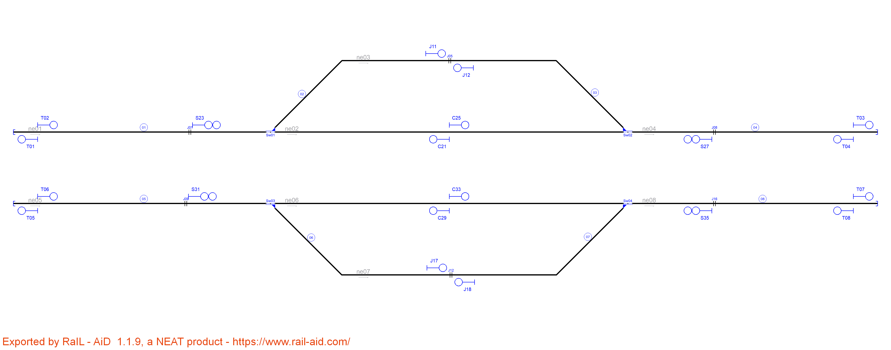

# Example_1
## Name: General example used in the paper

| Route  | Entry | Exit | Switches | Platforms | Crossings | netElements |
|  :---:  |  :---:  |  :---:  |  :---:  |  :---:  |  :---:  |  :---:  |
| R_01 |  S01  |  S17  | Sw04_N | - | - | ne01-ne08 |
| R_02 |  S01  |  S19  | Sw04_R + Sw07_N | - | - | ne01-ne09-ne15 |
| R_03 |  S01  |  S05  | Sw04_R + Sw07_R | - | - | ne01-ne09-ne14 |
| R_04 |  S17  |  S15  | Sw12_N | - | - | ne08-ne22 |
| R_05 |  S16  |  S02  | Sw12_N | - | - | ne22-ne08 |
| R_06 |  S17  |  S12  | Sw12_R + Sw13_R | - | - | ne08-ne24-ne12 |
| R_07 |  S10  |  S02  | Sw12_R + Sw13_R | - | - | ne12-ne24-ne08 |
| R_08 |  S10  |  S14  | Sw13_N | - | - | ne12-ne23 |
| R_09 |  S13  |  S12  | Sw13_N | - | - | ne23-ne12 |
| R_10 |  S07  |  S10  | Sw06_N | - | - | ne02-ne12 |
| R_11 |  S07  |  S09  | Sw06_R | Plat13 | Lc08 | ne02-ne13 |
| R_12 |  S05  |  S06  | - | Plat11 | Lc06 | ne14 |
| R_13 |  S06  |  S20  | - | - | - | ne14 |
| R_14 |  S09  |  S18  | - | - | - | ne13 |

| Route  | Entry | Exit | Switches | Platforms | Crossings | netElements |
|  :---:  |  :---:  |  :---:  |  :---:  |  :---:  |  :---:  |  :---:  |
| R_01 |  S22  |  S32  | Sw04_N  | - | - | ne01-ne08 |
| R_02 |  S22  |  T05  | Sw04_R + Sw07_N | - | - | ne01-ne09-ne15 |
| R_03 |  S32  |  X15  | Sw04_R + Sw07_R | - | - | ne01-ne09-ne14 |
| R_04 |  S32  |  J11  | Sw12_N | - | - | ne08-ne22 |
| R_05 |  J12  |  C21  | Sw12_N | - | - | ne22-ne08 |
| R_06 |  S32  |  C25  | Sw12_R + Sw13_R | - | - | ne08-ne24-ne12 |
| R_07 |  S35  |  C21  | Sw12_R + Sw13_R | - | - | ne12-ne24-ne08 |
| R_08 |  S35  |  J14  | Sw13_N | - | - | ne12-ne23 |
| R_09 |  J13  |  C25  | Sw13_N | - | - | ne23-ne12 |
| R_10 |  S27  |  S35  | Sw06_N | - | - | ne02-ne12 |
| R_11 |  S27  |  T01  | Sw06_R | Plat13 | Lc08 | ne02-ne13 |
| R_12 |  X15  |  T03  | - | Plat11 | Lc06 | ne14 |
| R_13 |  T04  |  X16  | - | Plat11 | - | ne14 |
| R_14 |  T02  |  P20  | - | Plat13 | Lc08 | ne13 |

Extra routes considering bidirectional tracks:
| Route  | Entry | Exit | Switches | Platforms | Crossings | netElements |
|  :---:  |  :---:  |  :---:  |  :---:  |  :---:  |  :---:  |  :---:  |
| R_15 |  T06  |  C29  | - | - | - | ne15 |
| R_16 |  J11  |  L09  | - | - | - | ne22 |
| R_17 |  J14  |  L10  | - | - | - | ne23 |
| R_18 |  X16  |  L07  | Sw04_R + Sw07_R | - | Lc06 | ne14-ne09-ne01 |
| R_19 |  C29  |  L07  | Sw04_N + Sw07_R | - | - | ne15-ne09-ne01 |
| R_20 |  C21  |  L07  | Sw04_N  | - | - | ne08-ne01 |
| R_21 |  P20  |  L08  | Sw06_R  | - | - | ne13-ne02 |
| R_22 |  C25  |  L08  | Sw06_N  | - | - | nex12-ne02 |

Routes 1 to 11 are the same in both interlocking tables.

Routes 12 and 13 in the original interlocking table were combined in Route Routet 12 because signals S06 and S20 were replaced by T03 due to proximity.

Route 14 was deleted because signal S09 was very close S18 and, therefore, unuseful as signal. Routes 11 and 14 in the original signalling were combined in Route 11 in the new signalling.

Routes 15 to 22 are created because RNA added signals T01,T02,T03,T04,T05 and T06 to protectt buffer stops and signals L07,L08,L09 and L10 to protect line borders. These new signals created new routes to stop prior the (relative or absolute) end of the network, increasing safety, and to add opposite routes than the originals, increasing mobility.

# Example_2
## Name: SimpleExample.railAID

| Route  | Entry | Exit | Switches | Platforms | Crossings | netElements |
|  :---:  |  :---:  |  :---:  |  :---:  |  :---:  |  :---:  |  :---:  |
| R_01 |  S07  |  S11  | Sw01_N  | - | - | ne14-ne16 |
| R_02 |  S08  |  S11  | Sw01_R  | - | - | ne15-ne16 |
| R_03 |  S09  |  S12  | Sw02_N  | - | - | ne18-ne16 |
| R_04 |  S10  |  S13  | Sw03_N  | - | - | ne20-ne19 |
| R_05 |  S10  |  S12  | Sw03_R + Sw02_R  | - | - | ne20-ne17-ne16  |

| Route  | Entry | Exit | Switches | Platforms | Crossings | netElements |
|  :---:  |  :---:  |  :---:  |  :---:  |  :---:  |  :---:  |  :---:  |
| R_01 |  P10  |  S18  | Sw01_N  | - | - | ne14-ne16 |
| R_02 |  B14  |  S18  | Sw01_R  | - | - | ne15-ne16 |
| R_03 |  P11  |  S15  | Sw02_N  | - | - | ne18-ne16 |
| R_04 |  S21  |  T01  | Sw03_N  | - | - | ne20-ne19 |
| R_05 |  S21  |  S15  | Sw03_R + Sw02_R | - | - | ne20-ne17-ne16 |

Extra routes considering bidirectional tracks:
| Route  | Entry | Exit | Switches | Platforms | Crossings | netElements |
|  :---:  |  :---:  |  :---:  |  :---:  |  :---:  |  :---:  |  :---:  |
| R_06 |  S15  |  P09  | Sw01_N  | - | Lc01 | ne16-ne14 |
| R_07 |  S15  |  L04  | Sw01_R  | - | Lc01 | ne16-ne15 |
| R_08 |  S18  |  P12  | Sw02_N  | - | Lc01 | ne16-ne18 |
| R_09 |  T02  |  L06  | SW03_N  | -  | - | ne19-ne20 |
| R_10 |  S18  |  L06  | Sw02_R + Sw03_R  | - | Lc01 | ne16-ne17-ne20 |

Routes 1 to 5 are the same in both interlocking tables, but RNA considers tracks as bidirectional while the original layout has only one direction per track. Routes 6 to 10 are the opposite of routes 1 to 5. It does not affect safety, RNA always considers every possible route in the layout. What is more, departure signal are considered for line borders and buffer stops for extra protection.

# Example_3
## Name: AdvancedExample.RailAID

| Route  | Entry | Exit | Switches | Platforms | Crossings | netElements |
|  :---:  |  :---:  |  :---:  |  :---:  |  :---:  |  :---:  |  :---:  |
| R_01 | 68N1 | 69Va | 68W02_R | - | Lc01 | ne7-ne9-ne95 |
| R_02 | 68N2 | 69Va | 68W02_N | - | Lc01 | ne1-ne9-ne95 |
| R_03 | 69Va | 69A | - | - | - | ne95-ne59 |
| R_04 | 69A | 69N2 | 69W03_N | Plat09 | - | ne59-ne17 |
| R_05 | 69A | 69N3 | Sw03_NN + 69W03_R + 69W04_R | Plat08 + Plat13 | - | ne59-ne11-ne52-ne77 |
| R_06 | 69B2 | 69P2 | Sw06_N | Plat09 | - | ne78-ne17 |
| R_07 | 69B2 | 69P3 | Sw06_R + Sw07_RR | Plat13 | - | ne78-ne79-ne77 |
| R_08 | 69B2 | 69P1 | Sw06_R + Sw07_RN | Plat12 | - | ne78-ne79-ne21 |
| R_09 | 69C | 69N1 | Sw04_RR | Plat12 | - | ne70-ne104-ne21 |
| R_10 | 69Vc | 69Vc1 | - | Plat7 | - | ne67-ne70 |
| R_11 | 70Va | 70A | - | - | - | ne103-ne64 |
| R_12 | 70N2 | 69Vc | 70W01_R | - | - | ne23-ne64-ne103-ne67 |
| R_13 | 70N1 | 69Vc | 70W0_N | - | - | ne24-ne64-ne103-ne67 |
| R_14 | 70B | 70N2 | 70W02_N | Plat05 | - | ne26-ne23 |
| R_15 | 70B | 70N1 | 70W02_R | Plat06 | - | ne26-ne24 |
| R_16 | 70A | 70P1 | 70W01_N | Plat06 | - | ne64-ne24 |
| R_17 | 70A | 70P2 | 70W01_R | Plat05 | - | ne64-ne23 |
| R_18 | 69W04Y | 69N3 | Sw03_NN + 69W04_N | Plat13 | - | ne14-ne52-ne77 |
| R_19 | 72-1 | S01 | Sw04_N | - | - | ne83-ne32 |
| R_20 | 72-3b | S01 | Sw04_R + Sw05_NR | - | - | ne41-ne82-ne32 |
| R_21 | 69B1 | 69P3 | Sw07_NR | Plat08 + Plat13 | - | ne97-ne94-ne77 |
| R_22 | 69P1 | 70Va | Sw03_RR | Plat07 | - | ne21-ne104-ne70-ne67-ne103 |
| R_23 | 69B1 | 69P1 | Sw07_NN | Plat12 | - | ne94-ne21 |
| R_24 | 69P2 | 68F | 69W03_N | - | Lc01 | ne17-ne59-ne95-ne9 |
| R_25 | 72-3b | 72B | Sw05_NN + Sw41_R | - | - | ne41-ne85-ne100 |
| R_26 | 72Va | 72A | - | - | - | ne44-ne104-ne100 |
| R_27 | 72-2 | 72B | Sw09_R + Sw41_N | - | - | ne29-ne110-ne100 |
| R_28 | S01 | 72B | Sw09_N + Sw41_N | - | - | ne32-ne110-ne100 |
| R_29 | 72B | 70B | 71W01_N | - | - | ne100-ne101-ne44-ne102-ne65-ne26 |
| R_30 | 69P3 | 68F | Sw03_NN + 69W03_R + 6904_R | - | Lc01 | ne77-ne52-ne11-ne59-ne95-ne9 |
| R_31 | 70P1 | 72Va | 70W02_R + 71W01_N | - | - | ne24-ne26-ne65-ne102-ne44 |
| R_32 | 70P2 | 72Va | 70W02_N + 71W01_N | - | - | ne23-ne26-ne65-ne102-ne44 |
| R_33 | 69Vc1 | 69C | - | - | - | ne70 |

| Route  | Entry | Exit | Switches | Platforms | Crossings | netElements |
|  :---:  |  :---:  |  :---:  |  :---:  |  :---:  |  :---:  |  :---:  |
| R_01 |  J43  |  L35  | 68W02_R | - | - | ne7-ne9-ne95 |
| R_02 |  P53  |  L35  | 68W02_N | - | - | ne1-ne9-ne95 |
| R_03 |  J48  |  S83  | - | - | Lc01 | ne95-ne59 |
| R_04 |  S83  |  P67  | 69W03_N | Plat09 | - | ne59-ne17 |
| R_05 |  S83  |  P75  | Sw03_NN + 69W03_R + 69W04_R | Plat08 + Plat13 | - | ne59-ne11-ne52-ne77 |
| R_06 |  S110  |  P66  | Sw06_N | Plat09 | - | ne78-ne17 |
| R_07 |  S110  |  P74  | Sw06_R + Sw07_RR | Plat08 + Plat13 | - | ne78-ne79-ne77 |
| R_08 |  S110 |  P72  | Sw06_R + Sw07_NR | Plat12 | - | ne78-ne79-ne21 |
| R_09 |  L32  |  P73  | Sw03_RR | Plat12 | - | ne70-ne104-ne21 |
| R_10 |  P64  |  L32  | - | - | - | ne67-ne70 |
| R_11 |  L41  |  S90  | - | - | - | ne103-ne64 |
| R_12 |  B89  |  P64  | 70W01_R | Plat05 | - | ne23-ne64-ne103-ne67 |
| R_13 |  P61  |  P64  | 70W01_N | Plat07 | - | ne24-ne64-ne103-ne67 |
| R_14 |  S93  |  B89  | 70W02_N | - | - | ne26-ne23 |
| R_15 |  S93  |  B92  | 70W02_R | Plat06 | - | ne26-ne24 |
| R_16 |  S90 |  P62  | 70W01_N | Plat06 | - | ne64-ne24 |
| R_17 |  S90  |  P60  | 70W01_R | Plat05 | - | ne64-ne23 |
| R_18 |  T08  |  P75  | Sw03_NN + 69W04_N | Plat08 + Plat13 | - | ne14-ne52-ne77 |
| R_19 |  P57  |  C100  | Sw04_N | - | - | ne83-ne32 |
| R_20 |  P59  |  C100  | S04_R + Sw05_NR | - | - | ne41-ne82-ne32 |
| R_21 |  L37  |  P74  | Sw07_NR | Plat08 + Plat13 | - | ne97-ne94-ne77 |
| R_22 |  P72  |  L31  | Sw03_RR | - | - | ne21-ne104-ne70-ne67 |
| R_23 |  L37  |  P72  | Sw07_NN | Plat12 | - | ne97-ne94-ne21 |
| R_24 |  P66  |  J49  | 69W03_N | - | - | ne17-ne59-ne95 |
| R_25 |  P59  |  S105  | Sw05_NN + Sw41_R | - | - | ne41-ne85-ne100-ne101-ne44 |
| R_26 |  L28  |  L40  | - | - | - | ne44-ne104 |
| R_27 |  S97  |  C124  | Sw08_R + Sw09_R | - | - | ne30-ne29-ne110 |
| R_28 |  C100  |  C124  | Sw09_N | - | - | ne32-ne110 |
| R_29 |  S105  |  S93  | 71W01_N | - | - | ne44-ne102-ne65-ne26 |
| R_30 |  S86  |  J49  | 69W03_R + 69W04_R | - | - | ne52-ne11-ne59-ne95 |
| R_31 |  J49  |  S80  | - | - | Lc01 | ne95-ne9 |
| R_32 |  P60  |  L27  | 70W02_N | - | - | ne23-ne26 |
| R_33 |  P62  |  L27  | 70W02_R | - | - | ne24-ne26 |
| R_34 |  L27  |  L30  | - | - | - | ne26-ne65 |
| R_35 |  C104  |  L28  | 71W01_N | - | - | ne102-ne44 |

Extra routes considering bidirectional tracks:
| Route  | Entry | Exit | Switches | Platforms | Crossings | netElements |
|  :---:  |  :---:  |  :---:  |  :---:  |  :---:  |  :---:  |  :---:  |
| R_36 |  T02  |  P53  | - | Plat01 | - | ne1 |
| R_37 |  T04  |  L42  | - | - | Ucr01 + Ocr01 | ne4-ne106 |
| R_38 |  T06  |  P55  | - | Plat02 | - | ne7 |
| R_39 |  T10  |  P59  | - | Plat04 | - | ne41 |
| R_40 |  T12  |  L29  | 71W02 | - | - | ne47-ne48 |
| R_41 |  T14  |  S105  | Sw05_RN + Sw41_R | - | - | ne84-ne85-ne100-ne101-ne44 |
| R_42 |  T14  |  C100  | Sw04_R + Sw05_RR | - | - | ne84-ne83-ne32 |
| R_43 |  T18  |  T15  | Sw11_N | - | - | ne88-ne86 |
| R_44 |  T20  |  S97  | Sw12_N | - | - | ne89-ne30 |
| R_45 |  T22  |  S97  | Sw12_R + Sw13_R | - | - | ne90-ne91-ne30 |
| R_46 |  T24  |  P70  | - | Plat11 | Ucr01 + Ocr01 | ne105-ne98-ne96 |
| R_47 |  L30  |  C104  | - | - | - | ne65-ne102 |
| R_48 |  L31  |  P65  | - | Plat07 | - | ne67 |
| R_49 |  L33  |  L34  | - | - | - | ne78-ne93 |
| R_50 |  L34  |  L38  | - | Plat11 | - | ne96-ne98 |
| R_51 |  L35  |  J48  | - | - | - | ne95 |
| R_52 |  L38  |  T23  | - | - | Ucr01 + Ocr01 | ne98-ne105 |
| R_53 |  L40  |  S126  | - | - | - | ne101-ne100 |
| R_54 |  L42  |  L37  | - | Plat10 | - | ne108-ne99-ne97 |
| R_55 |  P55  |  J43  | - | - | - | ne7 |
| R_56 |  P56  |  S119  | Sw08_N | - | - | ne83-ne30 |
| R_57 |  P65  |  L41  | - | - | - | ne67-ne103-ne64 |
| R_58 |  P67  |  L33  | Sw06_N | - | - | ne17-ne78 |
| R_59 |  P69  |  T03  | - | - | Ucr01 + Ocr01 | ne90-ne106-ne4 |
| R_60 |  P70  |  S110  | - | - | - | ne96-ne93-ne78 |
| R_61 |  P73  |  P69  | Sw07_NN | Plat10 | - | ne21-ne94-ne97-ne99 |
| R_62 |  P73  |  L33  | Sw07_NR | - | - | ne21-ne79-ne78 |
| R_63 |  P74  |  S86  | Sw03_NN | - | - | ne77-ne52 |
| R_64 |  P75  |  P69  | Sw07_RN | - | - | ne77-ne94-ne97-ne99 |
| R_65 |  P75  |  L33  | Sw06_R + Sw07_RR | - | - | ne77-ne79-ne78 |
| R_66 |  B92  |  P61  | - | - | - | ne24 |
| R_67 |  B96  |  S119  | Sw08_R | - | - | ne29-ne30 |
| R_68 |  B101  |  B96  | - | - | - | ne29 |
| R_69 |  C124  |  S105  | Sw41_N | - | - | ne110-ne100-ne101-ne44 |
| R_70 |  B125  |  T09  | Sw05_NN | Plat04 | - | ne85-ne41 |
| R_71 |  B125  |  T13  | Sw05_RN | - | - | ne85-ne84 |
| R_72 |  S80  |  T01  | 68W02_n | Plat01 | - | ne9-ne1 |
| R_73 |  S80  |  T05  | 68W02_R | Plat02 | - | ne9-ne7 |
| R_74 |  S86  |  T07  | 69W04_N | - | - | ne52-ne14 |
| R_75 |  S105 |  L29  | 71W01_R + 71W02_N | - | - | ne44-ne43-ne48 |
| R_76 |  S126  |  S102  | Sw41_N | - | - | ne100-ne110 |
| R_77 |  S126  |  B125 | Sw41_R | - | - | ne100-ne85 |
| R_78 |  S102  |  S113  | Sw09_N | - | - | ne110-ne32 |
| R_79 |  S102  |  B101  | Sw09_R | - | - | ne110-ne29 |
| R_80 |  S113  |  P56  | Sw04_N | Plat03 | - | ne32-ne83 |
| R_81 |  S113  |  T09  | Sw04_R + Sw05_NR | Plat04 | - | ne32-ne82-ne41 |
| R_82 |  S113  |  T13  | Sw04_R + Sw05_RR | - | - | ne32-ne82-ne84 |
| R_83 |  S119  |  T19  | Sw012_N | - | - | ne30-ne89 |
| R_84 |  S119  |  T15  | Sw11_R + Sw12_R + Sw13_N | - | - | ne30-ne91-ne87-ne86 |
| R_85 |  S119  |  T21 | Sw12_R + Sw13_R | - | - | ne30-ne91-ne90 |
| R_86 |  S97  |  P57  | Sw08_N | Plat03 | - | ne30-ne83 |
| R_87 |  T16  |  T17  | Sw11_N | - | - | ne86-ne88 |
| R_88 |  T16  |  S97  | Sw11_R + Sw12_R + Sw13_N | - | - | ne86-ne87-ne91-ne30 |

Routes 1 to 29 are equivalent in both interlocking tables.

Route 30 in the original signalling is splitted in route 30 and 31 by the RNA

Route 31 and 32 in the original signalling is splitted in routes 32/34/35 and 33/34/35 respectively.

Route 33 in the orignal signallins is integrated in Routes 9, 10 and 22 by the RNA.

Routes 34 to 88 are created considering all the signals generated to protect buffer stops, line borders and curves, and to considering bidirectional tracks. Disabling these functionalities both interlocking tables are equivalent without any other difference between them.

# Example_4
## Name: ERTMS_Test_Plant.RailAID

| Route  | Entry | Exit | Switches | Platforms | Crossings | netElements |
|  :---:  |  :---:  |  :---:  |  :---:  |  :---:  |  :---:  |  :---:  |
R_01  |  X19  |  S32  |  -  |  -  |  LC06-LC04  |  ne100-ne101
R_02  |  S32  |  S91  |  D09_N  |  -  |  -  |  ne101-ne912
R_03  |  C62  |  S04  |  SW02_R  |  -  |  -  |  ne104-ne384
R_04  |  B44  |  S04  |  SW02_N  |  -  |  -  |  ne110-ne384
R_05  |  S87  |  T08  |  -  |  -  |  -  |  ne114-ne102
R_06  |  B86  |  S87  |  D23_N  |  -  |  -  |  ne132-ne114
R_07  |  C89  |  C31  |  D20_N  |  -  |  -  |  ne132-ne912
R_08  |  S08  |  T03  |  D14_R + D15_R  |  -  |  -  |  ne290-ne111-ne377
R_09  |  C35  |  T01  |  D01_N  |  -  |  -  |  ne290-ne991
R_10  |  S09  |  C35  |  D14_N  |  -  |  -  |  ne292-ne290
R_11  |  S45  |  T01  |  D03_N + D01_R  |  -  |  -  |  ne295-ne288-ne991
R_12  |  B47  |  S40  |  D04_N  |  -  |  -  |  ne295-ne297
R_13  |  C43  |  S45  |  D04_N  |  -  |  -  |  ne297-ne295
R_14  |  S40  |  T02  |  SW03_N  |  -  |  -  |  ne297-ne995
R_15  |  S40  |  X15  |  Sw03_R + Sw04_R    |  -  |  LC02-LC01  |  ne297-ne997-ne996-ne98
R_16  |  S06  |  C35  |  D15_R + D14_R  |  -  |  -  |  ne377-ne111-ne290
R_17  |  S06  |  T10  |  D15_N  |  -  |  -  |  ne377-ne113
R_18  |  S04  |  S40  |  D04_R  |  -  |  -  |  ne384-ne297
R_19  |  C56  |  S58  |  D07_N  |  -  |  -  |  ne400-ne404
R_20  |  C56  |  S03  |  D07_R  |  -  |  -  |  ne400-ne407
R_21  |  S28  |  T04  |  Sw02_N    |  -  |  -  |  ne400-ne993
R_22  |  B52  |  S28  |  D07_N  |  -  |  -  |  ne404-ne400
R_23  |  S58  |  X16  |  D08_N + D05_R  |  -  |  LC02-LC01  |  ne404-ne61-ne99-ne98
R_24  |  S03  |  T11  |  D16_R  |  -  |  -  |  ne407-ne122
R_25  |  S10  |  S84  |  D18_R + D19_R  |  -  |  -  |  ne63-ne124-ne421
R_26  |  S10  |  S02  |  D18_N  |  -  |  -  |  ne63-ne65
R_27  |  C23  |  X16  |  D05_N  |  -  |  LC06-LC04  |  ne63-ne99-ne98
R_28  |  S11  |  C23  |  D18_N  |  -  |  -  |  ne65-ne63
R_29  |  C93  |  S95  |  D20_R + D21_R  |  -  |  -  |  ne912-ne131-ne465
R_30  |  C93  |  B86  |  D20_N  |  -  |  -  |  ne912-ne132
R_31  |  X15    |  S24    |  -  |   -   |   LC02   |  ne98-ne99
R_32  |  S07  |  S68  |  D01_N  |  -  |  -  |  ne991-ne290
R_33  |  B27  |  C56  |  Sw02_N    |  -  |  -  |  ne993-ne400
R_34  |  B39  |  C43  |  SW03_N  |  -  |  -  |  ne995-ne297
R_35  |  S24  |  S80  |  D05_N  |  -  |  -  |  ne99-ne63
R_36  |  X20  |  S11  |  SW01_N  |  -  |  (LC05-LC03) - (LC06-LC04)  |  ne100-ne992-ne65
R_37  |  X20  |  C56  |  Sw01_R + Sw02_R    |  -  |  (LC05-LC03) - (LC06-LC04)  |  ne100-ne992-ne994-ne400
R_38  |  S32  |  C59  |  D09_R + D10_N  |  -  |  -  |  ne101-ne910-ne130
R_39  |  S32  |  B60  |  D09_R + D10_R  |  -  |  -  |  ne101-ne910-ne135
R_40  |  S01  |  X20  |  D10_N + D9_R  |  -  |  LC06-LC04  |  ne130-ne910-ne101-ne100
R_41  |  B98  |  X20  |  D10_R + D09_R  |  -  |  LC05-LC03  |  ne135-ne910-ne101-ne100
R_42  |  S08  |  X15  |  D14_N + SW04_N  |  -  |  LC02-LC01  |  ne290-ne292-ne996-ne98
R_43  |  S28  |  X29  |  Sw02_R + Sw01_R    |  -  |  (LC05-LC03) - (LC06-LC04)  |  ne400-ne994-ne992-ne100
R_44  |  S02  |  X19  |  SW01_N  |  -  |  (LC05-LC03) - (LC06-LC04)  |  ne65-ne992-ne100
R_45  |  C31  |  X20  |  D09_N  |  -  |  LC06-LC04  |  ne912-ne101-ne100
R_46  |  X16    |  B67    |  Sw04_N    |  -  |  -  |  ne98-ne996-ne292
R_47  |  S16    |  S43    |  Sw03_R + Sw04_R    |  -  |  -  |  ne98-ne996-ne997-ne297
R_48  |  S07  |  B44  |  D01_R + D03_R  |  -  |  -  |  ne991-ne288-ne110
R_49  |  S07  |  B47  |  D01_R + D03_N  |  -  |  -  |  ne991-ne288-ne295
R_50  |  S24  |  B57  |  D05_R + D08_R  |  -  |  -  |  ne99-ne61-ne123
R_51  |  S24  |  B52  |  D05_R + D08_N  |  -  |  -  |  ne99-ne61-ne404
R_52  |  B63  |  T01  |  D03_R + D01_R  |  -  |  -  |  ne110-ne288-ne991
R_53  |  C74  |  S76  |  D16_R  |  -  |  -  |  ne122-ne407
R_54  |  B58  |  S76  |  D16_N  |  -  |  -  |  ne123-ne407
R_55  |  B75  |  X16  |  D08_R + D05_R  |  -  |  LC02-LC01  |  ne123-ne61-ne99-ne98
R_56  |  S99  |  S87  |  D12_S + D23_R  |  -  |  -  |  ne127-ne129-ne114
R_57  |  S99  |  T06  |  D12_T  |  -  |  -  |  ne127-ne450
R_58  |  C59  |  S87  |  D12_T + D23_R  |  -  |  -  |  ne130-ne129-ne114
R_59  |  C59  |  T06  |  D12_S  |  -  |  -  |  ne130-ne450
R_60  |  C97  |  S99  |  D24_R  |  -  |  -  |  ne134-ne127
R_61  |  B60  |  S99  |  D24_N  |  -  |  -  |  ne135-ne127
R_62  |  C43  |  C46  |  D04_R  |  -  |  -  |  ne297-ne384
R_63  |  C46  |  T09  |  Sw02_R  |  -  |  -  |  ne384-ne104
R_64  |  C46  |  B63  |  SW02_N  |  -  |  -  |  ne384-ne110
R_65  |  S03  |  B75  |  D16_N  |  -  |  -  |  ne407-ne123
R_66  |  S76  |  S28  |  D07_R  |  -  |  -  |  ne407-ne400
R_67  |  B83  |  T12  |  -  |  -  |  -  |  ne126
R_68  |  B90  |  C89  |  -  |  -  |  -  |  ne132
R_69  |  B94  |  T13  |  -  |  -  |  -  |  ne133
R_70  |  S68  |  S08  |  -  |  -  |  -  |  ne290
R_71  |  B67  |  S09  |  -  |  -  |  -  |  ne292
R_72  |  S84  |  H85  |  -  |  -  |  -  |  ne421
R_73  |  H85  |  T05  |  -  |  -  |  -  |  ne421
R_74  |  S95  |  H96  |  -  |  -  |  -  |  ne465
R_75  |  H96  |  T07  |  -  |  -  |  -  |  ne465
R_76  |  S80  |  S10  |  -  |  -  |  -  |  ne63

| Route  | Entry | Exit | Switches | Platforms | Crossings | netElements |
|  :---:  |  :---:  |  :---:  |  :---:  |  :---:  |  :---:  |  :---:  |
R_01  |  X56  |  S67  |  -  |  -  |  LC06-LC04  |  ne100-ne101
R_02  |  S67  |  S112  |  D09_N  |  -  |  -  |  ne101-ne912
R_03  |  T14  |  B78  |  SW02_R  |  -  |  -  |  ne104-ne384
R_04  |  B75  |  B78  |  SW02_N  |  -  |  -  |  ne110-ne384
R_05  |  J48  |  T11  |  -  |  -  |  -  |  ne114-ne102
R_06  |  J46  |  L29  |  D03_N  |  -  |  -  |  ne132-ne114
R_07  |  J47  |  J45  |  D20_N  |  -  |  -  |  ne132-ne912
R_08  |  S94  |  T03  |  D14_R + D15_R  |  -  |  -  |  ne290-ne111-ne377
R_09  |  J35  |  T01  |  D01_N  |  -  |    |  ne290-ne991
R_10  |  J37  |  J35  |  D14_N  |  -  |  -  |  ne292-ne290
R_11  |  C74  |  T01  |  D03_N + D01_R  |  -  |  -  |  ne295-ne288-ne991
R_12  |  C77  |  S125  |  D04_N  |  -  |  -  |  ne295-ne297
R_13  |  S79  |  C74  |  D04_N  |  -  |  -  |  ne297-ne295
R_14  |  S125  |  T27  |  SW03_N  |  -  |  -  |  ne297-ne995
R_15  |  S125  |  L30  |  SW03_R + SW04_R  |  -  |  -  |  ne297-ne997-ne996-ne98
R_16  |  T04  |  J35  |  D15_R + D14_R  |  -  |  -  |  ne377-ne111-ne290
R_17  |  T04  |  T15  |  D15_N  |  -  |  -  |  ne377-ne113
R_18  |  B78  |  S125  |  D04_R  |  -  |  -  |  ne384-ne297
R_19  |  S82  |  C84  |  D07_N  |  -  |  -  |  ne400-ne404
R_20  |  S82  |  S101  |  D07_R  |  -  |  -  |  ne400-ne407
R_21  |  S91  |  T25  |  SW02_N  |  -  |  -  |  ne400-ne993
R_22  |  C81  |  S91  |  D07_N  |  -  |  -  |  ne404-ne400
R_23  |  C84  |  X51  |  D08_N + D05_R  |  -  |  LC02-LC01  |  ne404-ne61-ne99-ne98
R_24  |  S101  |  T17  |  D16_R  |  -  |  -  |  ne407-ne122
R_25  |  S103  |  T05  |  D18_R + D19_R  |  -  |  -  |  ne63-ne124-ne421
R_26  |  S103  |  C121  |  D18_N  |  -  |  -  |  ne63-ne65
R_27  |  C62  |  X51  |  D05_N  |  -  |  LC02-LC01  |  ne63-ne99-ne98
R_28  |  C102  |  C62  |  D18_N  |  -  |  -  |  ne65-ne63
R_29  |  S112  |  T09  |  D20_R + D21_R  |  -  |  -  |  ne912-ne131-ne465
R_30  |  S112  |  J46  |  D20_N  |  -  |  -  |  ne912-ne132
R_31  |  X50  |  S63  |  -  |  -  |  LC02-LC01  |  ne98-ne99
R_32  |  S71  |  S94  |  D01_N  |  -  |  -  |  ne991-ne290
R_33  |  T26  |  S82  |  SW02_N  |  -  |  -  |  ne993-ne400
R_34  |  T28  |  S79  |  SW03_N  |  -  |  -  |  ne995-ne297
R_35  |  S63  |  S103  |  D05_N  |  -  |  -  |  ne99-ne63
R_36  |  X55  |  S122  |  -  |  -  |  LC05-LC03  |  ne100-ne992
R_37  |  J43  |  X57  |    |    |  LC06-LC04  |  ne101-ne100
R_38  |  S67  |  S89  |  D09_R  |  -  |  -  |  ne101-ne910
R_39  |  B85  |  S91  |  D16_N + D07_R  |  -  |  -  |  ne123-ne407-ne400
R_40  |  S119  |  J43  |  D24_N + D10_R + D09_R  |  -  |  -  |  ne127-ne135-ne910-ne101
R_41  |  C87  |  J43  |  D10_N + D09_R  |  -  |  -  |  ne130-ne910-ne101
R_42  |  S76  |  B75  |  D03_R  |  -  |  -  |  ne288-ne110
R_43  |  S76  |  C77  |  D03_N  |  -  |  -  |  ne288-ne295
R_44  |  S94  |  J36  |  D14_N  |  -  |  -  |  ne290-ne292
R_45  |  J36  |  L30  |  SW04_N  |  -  |  -  |  ne292-ne996-ne98
R_46  |  S91  |  L32  |  SW02_R + SW01_R  |  -  |  -  |  ne400-ne994-ne992
R_47  |  S86  |  B85  |  D08_R  |  -  |  -  |  ne61-ne123
R_48  |  S86  |  C81  |  D08_N  |  -  |  -  |  ne61-ne404
R_49  |  C121  |  L32  |  SW01_N  |  -  |  -  |  ne65-ne992
R_50  |  S89  |  B88  |  D10_R  |  -  |  -  |  ne910-ne135
R_51  |  J45  |  J43  |  D09_N  |  -  |  -  |  ne912-ne101
R_52  |  X51  |  S128  |  -  |  -  |  -  |  ne98-ne996
R_53  |  S71  |  S76  |  D01_R  |  -  |  -  |  ne991-ne288
R_54  |  L32  |  L31  |  -  |  -  |  -  |  ne992-ne100
R_55  |  S122  |  C102  |  SW01_N  |  -  |  -  |  ne992-ne65
R_56  |  S122  |  S82  |  SW01_R + SW02_R  |  -  |  -  |  ne992-ne994-ne400
R_57  |  S128  |  J37  |  SW04_N  |  -  |  -  |  ne996-ne292
R_58  |  S128  |  S79  |  SW04_R + SW03_R  |  -  |  -  |  ne996-ne997-ne297
R_59  |  S63  |  S86  |  D05_R  |  -  |  -  |  ne99-ne61
R_60  |  T18  |  S91  |  D16_R + D07_R  |  -  |  -  |  ne122-ne407-ne400
R_61  |  T24  |  L29  |  D24_R + D12_S + D23_R  |  -  |  -  |  ne134-ne127-ne129-ne114
R_62  |  T24  |  T07  |  D24_R + D12_T  |  -  |  -  |  ne134-ne127-ne450
R_63  |  B88  |  L29  |  D24_N + D12_S + D23_R  |  -  |  -  |  ne135-ne127-ne129-ne114
R_64  |  B88  |  T07  |  D24_N + D12_T  |  -  |  -  |  ne135-ne127-ne450
R_65  |  S79  |  T13  |  D04_R + SW02_R  |  -  |  -  |  ne297-ne384-ne104
R_66  |  S79  |  T01  |  D04_R + SW02_N +D03_R + D01_R  |  -  |  -  |  ne297-ne384-ne110-ne288-ne991
R_67  |  S101  |  X51  |  D08_R + D05_R  |  -  |  LC02-LC01  |  ne407-ne123-ne61-ne99-ne98
R_68  |  S89  |  L29  |  D10_N + D12_T + D23_R  |  -  |  -  |  ne910-ne130-ne129-ne114
R_69  |  S89  |  T07  |  D10_N + D12_S  |  -  |  -  |  ne910-ne130-ne450
R_70  |  L31  |  X54  |  -  |  -  |  LC05-LC03  |  ne100
R_71  |  X54  |  X56  |  -  |  -  |  -  |  ne100
R_72  |  X57  |  X55  |  -  |  -  |  (LC05-LC03) - (LC06-LC04)  |  ne100
R_73  |  T12  |  S109  |  -  |  -  |  -  |  ne102-ne114
R_74  |  T16  |  T03  |  D15_N  |  -  |  -  |  ne113-ne377
R_75  |  L29  |  J48  |  -  |  -  |  -  |  ne114
R_76  |  S109  |  J47  |  D23_N  |  -  |  -  |  ne114-ne132
R_77  |  S109  |  S119  |  D23_R + D12_S  |  -  |  -  |  ne115-ne129-ne127

Aditional routes example 3_B

| Route  | Entry | Exit | Switches | Platforms | Crossings | netElements |
|  :---:  |  :---:  |  :---:  |  :---:  |  :---:  |  :---:  |  :---:  |
R_78  |  S109  |  C87  |  D23_R + D12_T  |  -  |  -  |  ne115-ne129-ne130
R_79  |  T20  |  T05  |  D19_N  |  -  |  -  |  ne126-ne421
R_80  |  S119  |  T23  |  D24_R  |  -  |  -  |  ne127-ne134
R_81  |  T22  |  T09  |  D21_N  |  -  |  -  |  ne133-ne465
R_82  |  T06  |  C62  |  D19_R + D18_R  |  -  |  -  |  ne421-ne124-ne63
R_83  |  T06  |  T19  |  D19_N  |  -  |  -  |  ne421-ne126
R_84  |  T08  |  S119  |  D12_T  |  -  |  -  |  ne450-ne127
R_85  |  T08  |  C87  |  D12_S  |  -  |  -  |  ne450-ne130
R_86  |  T10  |  J45  |  D21_R + D20_R  |  -  |  -  |  ne465-ne131-ne912
R_87  |  T10  |  T21  |  D21_N  |  -  |  -  |  ne465-ne133
R_88  |  L30  |  X50  |  -  |  -  |  -  |  ne98
R_89  |  T02  |  S71  |  -  |  -  |  -  |  ne991
R_77  |  S91  |  C93  |  -  |  -  |  -  |  ne912

# Example_5
## Name:

| Route  | Entry | Exit | Switches | Platforms | Crossings | netElements |
|  :---:  |  :---:  |  :---:  |  :---:  |  :---:  |  :---:  |  :---:  |
| R_01 |  S01  |  S06  | Sw01_N  | - | - | ne01-ne02 |
| R_02 |  S05  |  S13  | Sw01_N  | - | - | ne02-ne01 |
| R_03 |  S01  |  S03  | Sw01_R  | - | - | ne01-ne03 |
| R_04 |  S04  |  S13  | Sw01_R  | - | - | ne03-ne01 |
| R_05 |  S02  |  S04  | Sw02_R  | - | - | ne04-ne02 |
| R_06 |  S06  |  S15  | Sw02_N  | - | - | ne02-ne04 |
| R_07 |  S02  |  S05  | Sw02_N  | - | - | ne04-ne03 |
| R_08 |  S03  |  S15  | Sw02_R  | - | - | ne03-ne04 |
| R_09 |  S07  |  S11  | Sw03_N  | - | - | ne05-ne06 |
| R_10 |  S10  |  S14  | Sw03_N  | - | - | ne06-ne05 |
| R_11 |  S07  |  S09  | Sw03_R  | - | - | ne05-ne07 |
| R_12 |  S08  |  S14  | Sw03_R  | - | - | ne07-ne05 |
| R_13 |  S12  |  S10  | Sw04_N  | - | - | ne08-ne06 |
| R_14 |  S11  |  S16  | Sw04_N  | - | - | ne06-ne08 |
| R_15 |  S12  |  S08  | Sw04_R  | - | - | ne08-ne07 |
| R_16 |  S09  |  S16  | Sw04_R  | - | - | ne07-ne08 |

| Route  | Entry | Exit | Switches | Platforms | Crossings | netElements |
|  :---:  |  :---:  |  :---:  |  :---:  |  :---:  |  :---:  |  :---:  |
| R_01 |  S23  |  C25  | Sw01_N | - | - | ne01-ne02 |
| R_02 |  C21  |  T01  | Sw01_N | - | - | ne02-ne01 |
| R_03 |  S23  |  J11  | Sw01_R | - | - | ne01-ne03 |
| R_04 |  J12  |  T01  | Sw01_R | - | - | ne03-ne01 |
| R_05 |  S27  |  C21  | Sw02_N | - | - | ne04-ne02 |
| R_06 |  C25  |  T03  | Sw02_N | - | - | ne02-ne04 |
| R_07 |  S27  |  J12  | Sw02_R | - | - | ne04-ne03 |
| R_08 |  J11  |  T04  | Sw02_R | - | - | ne03-ne04 |
| R_09 |  S31  |  C33  | Sw03_N | - | - | ne05-ne06 |
| R_10 |  C29  |  T05  | Sw03_N | - | - | ne06-ne05 |
| R_11 |  S31  |  J17  | Sw03_R | - | - | ne05-ne07 |
| R_12 |  J18  |  T05  | Sw03_R | - | - | ne07-ne05 |
| R_13 |  S35  |  C29  | Sw04_N | - | - | ne08-ne06 |
| R_14 |  C33  |  T07  | Sw04_N | - | - | ne06-ne08 |
| R_15 |  S35  |  J18  | Sw04_R | - | - | ne08-ne07 |
| R_16 |  J17  |  T07  | Sw04_R | - | - | ne07-ne08 |

Extra routes considering bidirectional tracks:
| Route  | Entry | Exit | Switches | Platforms | Crossings | netElements |
|  :---:  |  :---:  |  :---:  |  :---:  |  :---:  |  :---:  |  :---:  |
| R_17 |  T02  |  S23  | - | - | - | ne01 |
| R_18 |  T04  |  S27  | - | - | - | ne04 |
| R_19 |  T06  |  S31  | - | - | - | ne05 |
| R_20 |  T08  |  S35  | - | - | - | ne08 |

Routes 1 to 16 are the same in both interlocking tables, but RNA considers a departure signal is necessary close to buffer stops to allow trains to start moving. This authority could be delegated on signals S23,S31,S27 and S35 but they are far away their respective buffer stops. This extra four signals add four more routes to move the train from each buffer stop prior to every switch. It does not affect safety but it adds an extra step before a critical action, increasing safety.

# Example_6

| Route  | Entry | Exit | Switches | Platforms | Crossings | netElements |
|  :---:  |  :---:  |  :---:  |  :---:  |  :---:  |  :---:  |  :---:  |
| R_01 | S01 | S06 | Sw01_N | - | - | ne01-ne03 |
| R_02 | S01 | S13 | Sw01_R + Sw03_R | - | - | ne01-ne02-ne06 |
| R_03 | S01 | S18 | Sw01_R + Sw03_N | - | - | ne01-ne02-ne07 |
| R_04 | S06 | S07 | Sw02_N | - | - | ne03-ne05 |
| R_05 | S06 | S12 | Sw02_R | - | - | ne03-ne04 |
| R_06 | S21 | S19 | Sw08_N | - | - | ne41-ne07 |
| R_07 | S21 | S14 | Sw08_R | - | - | ne41-ne42 |
| R_08 | S05 | S02 | Sw01_N | - | - | ne03-ne01 |
| R_09 | S09 | S08 | Sw05_N | - | - | ne11-ne05 |
| R_10 | S08 | S05 | Sw02_N | - | - | ne05-ne03 |
| R_11 | S10 | S08 | Sw05_R | - | - | ne10-ne05 |
| R_12 | S15 | S16 | Sw08_R | - | - | ne42-ne41 |
| R_13 | S18 | S16 | Sw08_N | - | - | ne07-ne41 |
| R_14 | S19 | S20 | - | - | - | ne07 |
| R_15 | S20 | S02 | Sw01_R + Sw03_N | - | - | ne07-ne02-ne01 |
| R_16 | S07 | S11 | Sw05_R | - | - | ne05-ne10 |

| Route  | Entry | Exit | Switches | Platforms | Crossings | netElements |
|  :---:  |  :---:  |  :---:  |  :---:  |  :---:  |  :---:  |  :---:  |
| R_01 | S22 | S27 | Sw01_N | - | - | ne01-ne03 |
| R_02 | S22 | T03 | Sw01_R + Sw03_R | - | - | ne01-ne02-ne06 |
| R_03 | S22 | J19 | Sw01_R + Sw03_N | - | - | ne01-ne02-ne07 |
| R_04 | S27 | S22 | Sw02_N | - | - | ne03-ne05 |
| R_05 | S27 | T01 | Sw02_R | - | - | ne03-ne04 |
| R_06 | S37 | J20 | Sw08_N | - | - | ne41-ne07 |
| R_07 | S37 | T09 | Sw08_R | - | - | ne41-ne42 |
| R_08 | C21 | J18 | Sw01_N | - | - | ne03-ne01 |
| R_09 | J14 | J16 | Sw05_N | - | - | ne11-ne05 |
| R_10 | J16 | C21 | Sw02_N | - | - | ne05-ne03 |
| R_11 | T06 | J16 | Sw05_R | - | - | ne10-ne05 |
| R_12 | B36 | T07 | Sw08_R | - | - | ne42-ne41 |
| R_13 | J19 | T07 | Sw08_N | - | - | ne07-ne41 |
| R_14 | J20 | C29 | - | - | - | ne07 |
| R_15 | C29 | J18 | Sw01_R + Sw03_N | - | - | ne07-ne02-ne01 |
| R_16 | S33 | T05 | Sw05_R | - | - | ne05-ne10 |

Extra routes considering bidirectional tracks:
| Route  | Entry | Exit | Switches | Platforms | Crossings | netElements |
|  :---:  |  :---:  |  :---:  |  :---:  |  :---:  |  :---:  |  :---:  |
| R_17 | S33 | J13 | Sw05_N | - | - | ne05-ne11 |
| R_18 | T04 | J18 | Sw01_R + Sw03_R | - | - | ne06-ne02-ne01 |
| R_19 | B26 | C21 | Sw02_R | - | - | ne04-ne03 |
| R_20 | T02 | B26 | - | - | - | ne04 |
| R_21 | T08 | S37 | - | - | - | ne41 |
| R_22 | T10 | B36 | - | - | - | ne42 |
| R_23 | J18 | L11 | - | - | - | ne01 |

Routes 1 to 16 are equivalent in both interlocking tables.

The RNA adds departure signlas T02, T08 and T10, creating new routes 20,21 and 22 used to insert back trains in the main line.

Routes 17, 18, 19 and 23 use new signals added by the RNA, necessary to improve mobility.

With these changes it is possible to cover all the layout in any direction without any restriction.

# Example_7

| Route  | Entry | Exit | Switches | Platforms | Crossings | netElements |
|  :---:  |  :---:  |  :---:  |  :---:  |  :---:  |  :---:  |  :---:  |
| R_01 |  S01  |  S02  | Sw18_N | - | - | ne01-ne41 |
| R_02 |  S01  |  S06  | Sw14_N + Sw18_R | - | - | ne01-ne40-ne32 |
| R_03 |  S01  |  S07  | Sw14_R + Sw18_R | - | - | ne01-ne40-ne31 |
| R_04 |  S03  |  S09  | Sw19_N | - | - | ne42-ne43 |
| R_05 |  S03  |  S10  | Sw18_N + Sw19_R | - | - | ne42-ne41-ne01 |
| R_06 |  S02  |  S08  | Sw19_R | - | - | ne41-ne42 |
| R_07 |  S04  |  S10  | Sw14_R + Sw18_R | - | - | ne31-ne40-ne01 |
| R_08 |  S05  |  S10  | Sw14_N + Sw18_R | - | - | ne32-ne40-ne01 |

| Route  | Entry | Exit | Switches | Platforms | Crossings | netElements |
|  :---:  |  :---:  |  :---:  |  :---:  |  :---:  |  :---:  |  :---:  |
| R_01 |  S14  |  B18  | Sw18_N | - | - | ne01-ne41 |
| R_02 |  S14  |  T05  | Sw14_N + Sw18_R | - | - | ne01-ne40-ne32 |
| R_03 |  S14  |  T03  | Sw14_R + Sw18_R | - | - | ne01-ne40-ne31 |
| R_04 |  S19  |  T09  | Sw19_N | - | - | ne42-ne43 |
| R_05 |  S19  |  T01  | Sw18_N + Sw19_R | - | - | ne42-ne41-ne01 |
| R_06 |  B18  |  T07  | Sw19_R | - | - | ne41-ne42 |
| R_07 |  T04  |  T01  | Sw14_R + Sw18_R | - | - | ne31-ne40-ne01 |
| R_08 |  C11  |  T01  | Sw14_N + Sw18_R | - | - | ne32-ne40-ne01 |

Extra routes considering bidirectional tracks:
| Route  | Entry | Exit | Switches | Platforms | Crossings | netElements |
|  :---:  |  :---:  |  :---:  |  :---:  |  :---:  |  :---:  |  :---:  |
| R_09 |  T02  |  S14  | - | - | - | ne01 |
| R_10 |  T06  |  C11  | - | - | - | ne32 |
| R_11 |  T08  |  S19  | - | - | - | ne42 |
| R_12 |  T10  |  T07  | Sw19_N | - | - | ne43-ne42 |

Routes 1 to 8 are equivalente in both interlocking tables.

The RNA adds departure signal T02, T06, T08 and T10 to protect buffer stops. Signals T02, T06 and T08 are used to allow stopped trains to move close to the main signals S14, S19 and C11. signal T04 is used to insert trains back to the main line. These extra signals increase safety by protecting the buffer stops, mandatory in many countries. If the buffer stops are configured to not be protected then both interlocking tables are the same.

# Example_8

| Route  | Entry | Exit | Switches | Platforms | Crossings | netElements |
|  :---:  |  :---:  |  :---:  |  :---:  |  :---:  |  :---:  |  :---:  |
| R_01 |  S01  |  S02  | - | Plat03 | Lc07 | ne02 |
| R_02 |  S04  |  S07  | - | Plat02 | Lc08 | ne01 |
| R_03 |  S06  |  S05  | - | Plat02 | Lc08 | ne01 |

| Route  | Entry | Exit | Switches | Platforms | Crossings | netElements |
|  :---:  |  :---:  |  :---:  |  :---:  |  :---:  |  :---:  |  :---:  |
| R_01 |  X09  |  P16  | - | Plat03 | Lc07 | ne02 |
| R_02 |  T02  |  T03  | - | Plat02 | Lc08 | ne01 |
| R_03 |  T08  |  X10  | - | Plat03 | - | ne02 |
| R_04 |  X10  |  T05  | - | - | Lc07 | ne02 |
| R_05 |  T04  |  P13  | - | Plat02 | - | ne01 |
| R_06 |  X12  |  T01  | - | - | Lc08 | ne02 |
| R_07 |  T06  |  X09  | - | - | - | ne02 |
| R_08 |  P13  |  X12  | - | - | - | ne02 |
| R_09 |  P16  |  T07  | - | - | - | ne01 |

Routes 1 to 3 in the original layout are equivalent to routes 1 and 2 in the new signalling. 

Routes 3 to 4 in the new signalling are equivalent to route 1 in the original signalling but with a stop between the platform and the level crossing and in the opposite direction.

Routes 5 to 6 in the new signalling include a stop between the level crossing and the platform. They can be consider as equivalents to route 3 in the original signalling or to route 2 with an opposite direction.

Route 7 is used to approach carefully the level crossing.
Route 8 is used as a departure signal from the platform to move up to the level crossing
Route 9 is added as a departure signal tot stop before the end of the line. The original layout had no stop signals prior buffer stops.

# Example_9

| Route  | Entry | Exit | Switches | Platforms | Crossings | netElements |
|  :---:  |  :---:  |  :---:  |  :---:  |  :---:  |  :---:  |  :---:  |
| R_01 | S03 | S04 | - | - | - | ne26 |
| R_02 | S04 | S05 | - | - | - | ne26 |
| R_03 | S05 | S06 | - | - | - | ne26 |
| R_04 | S06 | S07 | - | - | - | ne26 |
| R_05 | S07 | S08 | - | - | - | ne26 |
| R_06 | S08 | S09 | Sw12_N | - | - | ne26-ne03 |
| R_07 | S52 | S53 | - | - | - | ne25 |
| R_08 | S53 | S54 | Sw11_N | - | - | ne25-ne23 |
| R_09 | S54 | S55 | - | - | - | ne23 |
| R_10 | S55 | S56 | - | - | - | ne23 |
| R_11 | S56 | S58 | - | - | - | ne23 |
| R_12 | S58 | S57 | - | - | - | ne23 |
| R_13 | S59 | S09 | Sw11_R + Sw12_R | - | - | ne23-ne27-ne03 |
| R_14 | S36 | S54 | Sw11_R + Sw12_R | - | - | ne03-ne27-ne23 |

| Route  | Entry | Exit | Switches | Platforms | Crossings | netElements |
|  :---:  |  :---:  |  :---:  |  :---:  |  :---:  |  :---:  |  :---:  |
| R_01 | J07 | J09 | - | - | - | ne26 |
| R_02 | J09 | J11 | - | - | - | ne26 |
| R_03 | J11 | J13 | - | - | - | ne26 |
| R_04 | J13 | J15 | - | - | - | ne26 |
| R_05 | J15 | J17 | Sw12_N | - | - | ne26-ne03 |
| R_06 | J17 | L05 | - | - | - | ne03 |
| R_07 | T04 | J32 | - | - | - | ne25 |
| R_08 | J32 | J30 | Sw11_N | - | - | ne25-ne23 |
| R_09 | J30 | J28 | - | - | - | ne23 |
| R_10 | J28 | J26 | - | - | - | ne23 |
| R_11 | J26 | J24 | - | - | - | ne23 |
| R_12 | J24 | J22 | - | - | - | ne23 |
| R_13 | J22 | T01 | - | - | - | ne23 |
| R_14 | S36 | J17 | Sw11_R + Sw12_R | - | - | ne23-ne27-ne03 |
| R_15 | S39 | J30 | Sw11_R + Sw12_R | - | - | ne03-ne27-ne23 |

Extra routes considering bidirectional tracks:
| Route  | Entry | Exit | Switches | Platforms | Crossings | netElements |
|  :---:  |  :---:  |  :---:  |  :---:  |  :---:  |  :---:  |  :---:  |
| R_16 | J20 | S39 | - | - | - | ne03 |
| R_17 | S39 | J16 | Sw12_N | - | - | ne03-ne26 |
| R_18 | J16 | J14 | - | - | - | ne26 |
| R_19 | J14 | J12 | - | - | - | ne26 |
| R_20 | J12 | J10 | - | - | - | ne26 |
| R_21 | J10 | L06 | - | - | - | ne26 |
| R_22 | T02 | J23 | - | - | - | ne23 |
| R_23 | J23 | J25 | - | - | - | ne23 |
| R_24 | J25 | J27 | - | - | - | ne23 |
| R_25 | J27 | S36 | - | - | - | ne23 |
| R_26 | S36 | J31 | Sw11_N | - | - | ne23-ne25 |
| R_27 | J31 | J33 | - | - | - | ne25 |
| R_28 | J33 | T03 | - | - | - | ne25|

Routes 1 to 6 are equivalent in both interlocking tables. However, because the original layout introduce signals at the beginning of every track while RNA introduces signals prior every danger, there are 6 signals before switch 12 and 1 signal after it in the original signalling but 5 and 2 in the new signalling generated by the RNA respectively. The original signalling needs 5 routes to reach the switch and 1 to cross it, while RNA creates 4 routes to reach the switch, 1 to cross it and 1 extra for moving further.

Routes 7 to 12 are equivalent to routes 7 to 13 in the new signalling. The extra route corresponds to the signal protecting the buffer stop, which introduces a new route.

Routes 13 and 14 are equivalent to routes 14 and 15.

Routes 16 to 28 are equivalente to routes 1 to 12 but in the opposite direction. If we consider only one-way tracks then these routes are ignored, obtaining the same interlocking table both in the original signalling and by RNA.

