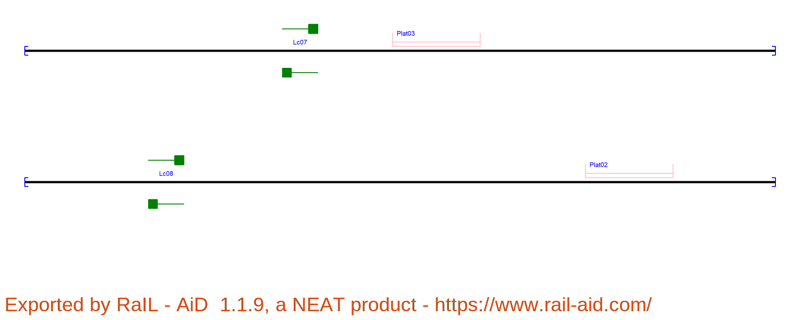
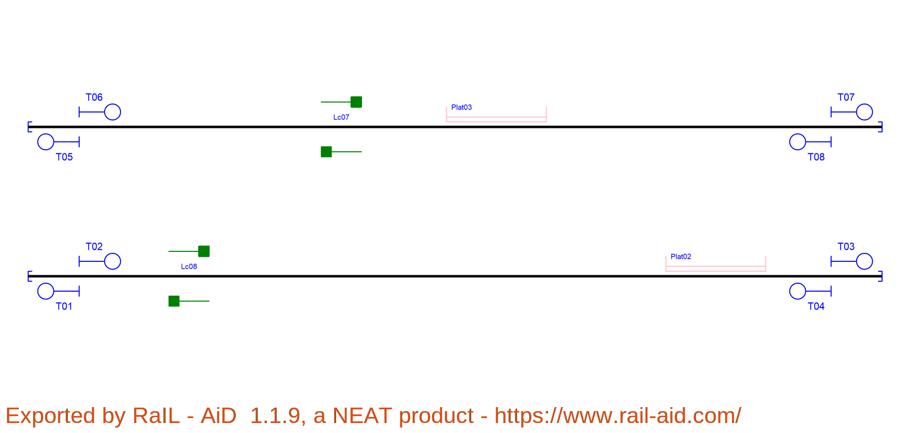
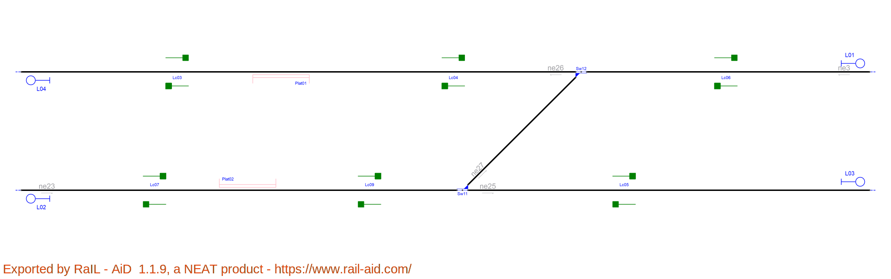
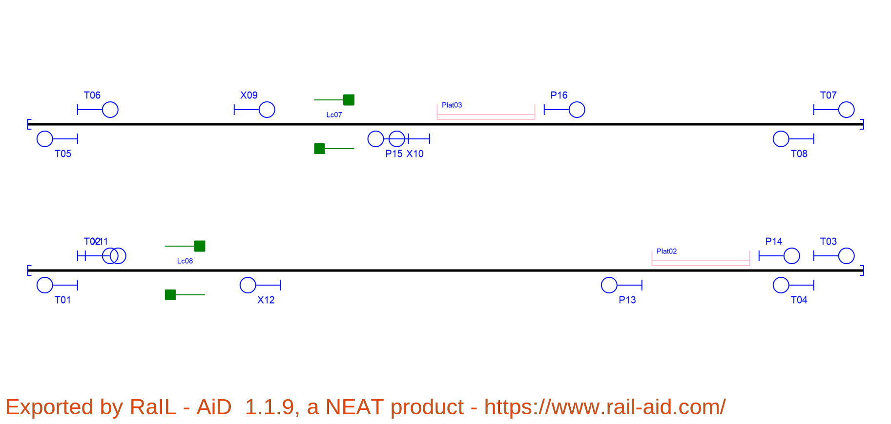
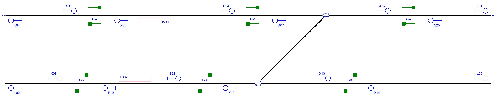

# Example_8
## Description
Name:  

## Step by step

Layout without signalling:

Signals generated due to line borders(L) and buffer stops(T):

Signals generated due to line borders(L),buffer stops(T) and rail joints (J):

Signals generated due to line borders(L),buffer stops(T),rail joints (J), platforms(P) and level crossings(X):

Signals generated due to line borders(L),buffer stops(T),rail joints (J), platforms(P),level crossings(X) and switches(S,H,C,B):

Simplified signalling:

## Original table

| Route  | Entry | Exit | Switches | Platforms | Crossings | netElements |
|  :---:  |  :---:  |  :---:  |  :---:  |  :---:  |  :---:  |  :---:  |
| R_01 |  S01  |  S02  | - | Plat03 | Lc07 | ne02 |
| R_02 |  S04  |  S07  | - | Plat02 | Lc08 | ne01 |
| R_03 |  S06  |  S05  | - | Plat02 | Lc08 | ne01 |

## Generated table

| Route  | Entry | Exit | Switches | Platforms | Crossings | netElements |
|  :---:  |  :---:  |  :---:  |  :---:  |  :---:  |  :---:  |  :---:  |
| R_01 |  X09  |  P16  | - | Plat03 | Lc07 | ne02 |
| R_02 |  T02  |  T03  | - | Plat02 | Lc08 | ne01 |
| R_03 |  T08  |  X10  | - | Plat03 | - | ne02 |
| R_04 |  X10  |  T05  | - | - | Lc07 | ne02 |
| R_05 |  T04  |  P13  | - | Plat02 | - | ne01 |
| R_06 |  X12  |  T01  | - | - | Lc08 | ne02 |
| R_07 |  T06  |  X09  | - | - | - | ne02 |
| R_08 |  P13  |  X12  | - | - | - | ne02 |
| R_09 |  P16  |  T07  | - | - | - | ne01 |

Routes 1 to 3 in the original layout are equivalent to routes 1 and 2 in the new signalling. 

Routes 3 to 4 in the new signalling are equivalent to route 1 in the original signalling but with a stop between the platform and the level crossing and in the opposite direction.

Routes 5 to 6 in the new signalling include a stop between the level crossing and the platform. They can be consider as equivalents to route 3 in the original signalling or to route 2 with an opposite direction.

Route 7 is used to approach carefully the level crossing.
Route 8 is used as a departure signal from the platform to move up to the level crossing
Route 9 is added as a departure signal tot stop before the end of the line. The original layout had no stop signals prior buffer stops.
