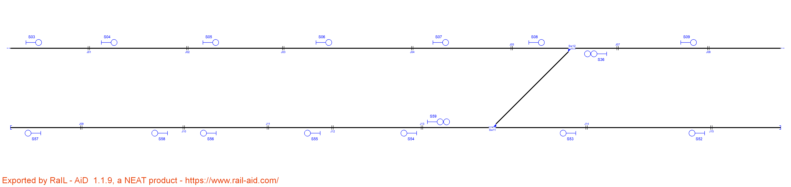
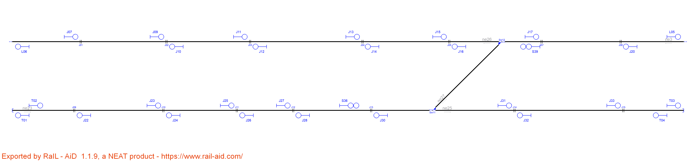

# Example_9

| Route  | Entry | Exit | Switches | Platforms | Crossings | netElements |
|  :---:  |  :---:  |  :---:  |  :---:  |  :---:  |  :---:  |  :---:  |
| R_01 | S03 | S04 | - | - | - | ne26 |
| R_02 | S04 | S05 | - | - | - | ne26 |
| R_03 | S05 | S06 | - | - | - | ne26 |
| R_04 | S06 | S07 | - | - | - | ne26 |
| R_05 | S07 | S08 | - | - | - | ne26 |
| R_06 | S08 | S09 | Sw12_N | - | - | ne26-ne03 |
| R_07 | S52 | S53 | - | - | - | ne25 |
| R_08 | S53 | S54 | Sw11_N | - | - | ne25-ne23 |
| R_09 | S54 | S55 | - | - | - | ne23 |
| R_10 | S55 | S56 | - | - | - | ne23 |
| R_11 | S56 | S58 | - | - | - | ne23 |
| R_12 | S58 | S57 | - | - | - | ne23 |
| R_13 | S59 | S09 | Sw11_R + Sw12_R | - | - | ne23-ne27-ne03 |
| R_14 | S36 | S54 | Sw11_R + Sw12_R | - | - | ne03-ne27-ne23 |

| Route  | Entry | Exit | Switches | Platforms | Crossings | netElements |
|  :---:  |  :---:  |  :---:  |  :---:  |  :---:  |  :---:  |  :---:  |
| R_01 | J07 | J09 | - | - | - | ne26 |
| R_02 | J09 | J11 | - | - | - | ne26 |
| R_03 | J11 | J13 | - | - | - | ne26 |
| R_04 | J13 | J15 | - | - | - | ne26 |
| R_05 | J15 | J17 | Sw12_N | - | - | ne26-ne03 |
| R_06 | J17 | L05 | - | - | - | ne03 |
| R_07 | T04 | J32 | - | - | - | ne25 |
| R_08 | J32 | J30 | Sw11_N | - | - | ne25-ne23 |
| R_09 | J30 | J28 | - | - | - | ne23 |
| R_10 | J28 | J26 | - | - | - | ne23 |
| R_11 | J26 | J24 | - | - | - | ne23 |
| R_12 | J24 | J22 | - | - | - | ne23 |
| R_13 | J22 | T01 | - | - | - | ne23 |
| R_14 | S36 | J17 | Sw11_R + Sw12_R | - | - | ne23-ne27-ne03 |
| R_15 | S39 | J30 | Sw11_R + Sw12_R | - | - | ne03-ne27-ne23 |

Extra routes considering bidirectional tracks:
| Route  | Entry | Exit | Switches | Platforms | Crossings | netElements |
|  :---:  |  :---:  |  :---:  |  :---:  |  :---:  |  :---:  |  :---:  |
| R_16 | J20 | S39 | - | - | - | ne03 |
| R_17 | S39 | J16 | Sw12_N | - | - | ne03-ne26 |
| R_18 | J16 | J14 | - | - | - | ne26 |
| R_19 | J14 | J12 | - | - | - | ne26 |
| R_20 | J12 | J10 | - | - | - | ne26 |
| R_21 | J10 | L06 | - | - | - | ne26 |
| R_22 | T02 | J23 | - | - | - | ne23 |
| R_23 | J23 | J25 | - | - | - | ne23 |
| R_24 | J25 | J27 | - | - | - | ne23 |
| R_25 | J27 | S36 | - | - | - | ne23 |
| R_26 | S36 | J31 | Sw11_N | - | - | ne23-ne25 |
| R_27 | J31 | J33 | - | - | - | ne25 |
| R_28 | J33 | T03 | - | - | - | ne25|

Routes 1 to 6 are equivalent in both interlocking tables. However, because the original layout introduce signals at the beginning of every track while RNA introduces signals prior every danger, there are 6 signals before switch 12 and 1 signal after it in the original signalling but 5 and 2 in the new signalling generated by the RNA respectively. The original signalling needs 5 routes to reach the switch and 1 to cross it, while RNA creates 4 routes to reach the switch, 1 to cross it and 1 extra for moving further.

Routes 7 to 12 are equivalent to routes 7 to 13 in the new signalling. The extra route corresponds to the signal protecting the buffer stop, which introduces a new route.

Routes 13 and 14 are equivalent to routes 14 and 15.

Routes 16 to 28 are equivalente to routes 1 to 12 but in the opposite direction. If we consider only one-way tracks then these routes are ignored, obtaining the same interlocking table both in the original signalling and by RNA.

