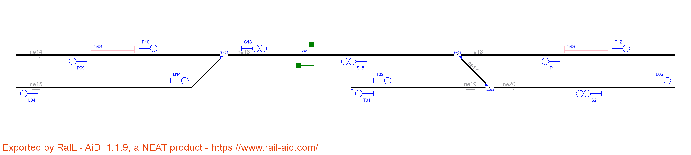
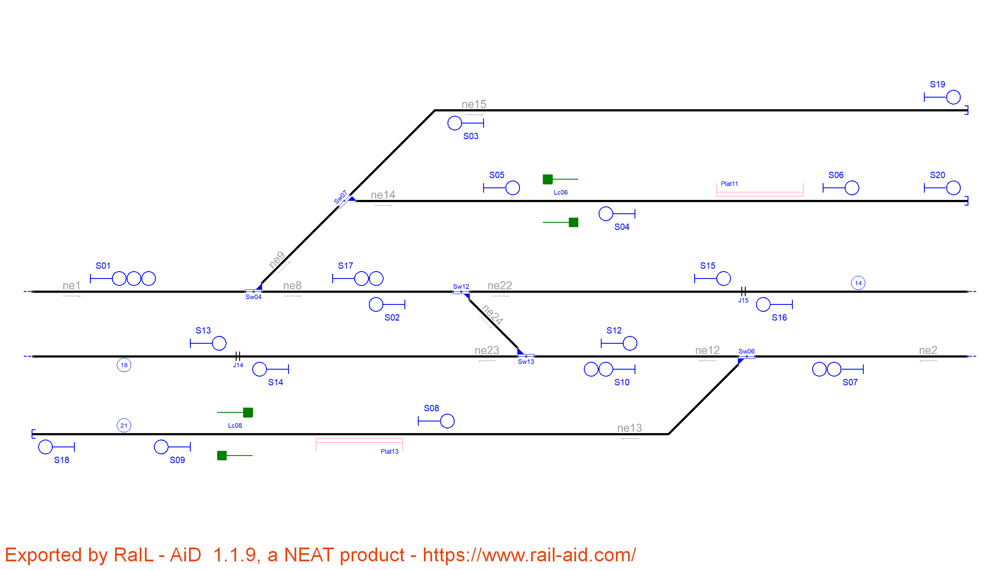

# Example_1
## Name: 

| Route  | Entry | Exit | Switches | Platforms | Crossings | netElements |
|  :---:  |  :---:  |  :---:  |  :---:  |  :---:  |  :---:  |  :---:  |
| R_01 |  S07  |  S11  | Sw01_N  | - | - | ne14-ne16 |
| R_02 |  S08  |  S11  | Sw01_R  | - | - | ne15-ne16 |
| R_03 |  S09  |  S12  | Sw02_N  | - | - | ne18-ne16 |
| R_04 |  S10  |  S13  | Sw03_N  | - | - | ne20-ne19 |
| R_05 |  S10  |  S12  | Sw03_R + Sw02_R  | - | - | ne20-ne17-ne16  |

| Route  | Entry | Exit | Switches | Platforms | Crossings | netElements |
|  :---:  |  :---:  |  :---:  |  :---:  |  :---:  |  :---:  |  :---:  |
| R_01 |  P10  |  S18  | Sw01_N  | - | - | ne14-ne16 |
| R_02 |  B14  |  S18  | Sw01_R  | - | - | ne15-ne16 |
| R_03 |  P11  |  S15  | Sw02_N  | - | - | ne18-ne16 |
| R_04 |  S21  |  T01  | Sw03_N  | - | - | ne20-ne19 |
| R_05 |  S21  |  S15  | Sw03_R + Sw02_R | - | - | ne20-ne17-ne16 |
| R_06 |  S15  |  P09  | Sw01_N  | - | Lc01 | ne16-ne14 |
| R_07 |  S15  |  L04  | Sw01_R  | - | Lc01 | ne16-ne15 |
| R_08 |  S18  |  P12  | Sw02_N  | - | Lc01 | ne16-ne18 |
| R_09 |  T02  |  L06  | SW03_N  | -  | - | ne19-ne20 |
| R_10 |  S18  |  L06  | Sw02_R + Sw03_R  | - | Lc01 | ne16-ne17-ne20 |

Routes 1 to 5 are the same in both interlocking tables, but RNA considers tracks as bidirectional while the original layout has only one direction per track. Routes 6 to 10 are the opposite of routes 1 to 5. It does not affect safety, RNA always considers every possible route in the layout. What is more, departure signal are considered for line borders and buffer stops for extra protection.

# Example_2
## Name: 

# Example_3
## Name:

# Example_4
## Name:

| Route  | Entry | Exit | Switches | Platforms | Crossings | netElements |
|  :---:  |  :---:  |  :---:  |  :---:  |  :---:  |  :---:  |  :---:  |
| R_01 |  S01  |  S06  | Sw01_N  | - | - | ne01-ne02 |
| R_02 |  S05  |  S13  | Sw01_N  | - | - | ne02-ne01 |
| R_03 |  S01  |  S03  | Sw01_R  | - | - | ne01-ne03 |
| R_04 |  S04  |  S13  | Sw01_R  | - | - | ne03-ne01 |
| R_05 |  S02  |  S04  | Sw02_R  | - | - | ne04-ne02 |
| R_06 |  S06  |  S15  | Sw02_N  | - | - | ne02-ne04 |
| R_07 |  S02  |  S05  | Sw02_N  | - | - | ne04-ne03 |
| R_08 |  S03  |  S15  | Sw02_R  | - | - | ne03-ne04 |
| R_09 |  S07  |  S11  | Sw03_N  | - | - | ne05-ne06 |
| R_10 |  S10  |  S14  | Sw03_N  | - | - | ne06-ne05 |
| R_11 |  S07  |  S09  | Sw03_R  | - | - | ne05-ne07 |
| R_12 |  S08  |  S14  | Sw03_R  | - | - | ne07-ne05 |
| R_13 |  S12  |  S10  | Sw04_N  | - | - | ne08-ne06 |
| R_14 |  S11  |  S16  | Sw04_N  | - | - | ne06-ne08 |
| R_15 |  S12  |  S08  | Sw04_R  | - | - | ne08-ne07 |
| R_16 |  S09  |  S16  | Sw04_R  | - | - | ne07-ne08 |

| Route  | Entry | Exit | Switches | Platforms | Crossings | netElements |
|  :---:  |  :---:  |  :---:  |  :---:  |  :---:  |  :---:  |  :---:  |
| R_01 |  S23  |  C25  | Sw01_N | - | - | ne01-ne02 |
| R_02 |  C21  |  T01  | Sw01_N | - | - | ne02-ne01 |
| R_03 |  S23  |  J11  | Sw01_R | - | - | ne01-ne03 |
| R_04 |  J12  |  T01  | Sw01_R | - | - | ne03-ne01 |
| R_05 |  S27  |  C21  | Sw02_N | - | - | ne04-ne02 |
| R_06 |  C25  |  T03  | Sw02_N | - | - | ne02-ne04 |
| R_07 |  S27  |  J12  | Sw02_R | - | - | ne04-ne03 |
| R_08 |  J11  |  T04  | Sw02_R | - | - | ne03-ne04 |
| R_09 |  S31  |  C33  | Sw03_N | - | - | ne05-ne06 |
| R_10 |  C29  |  T05  | Sw03_N | - | - | ne06-ne05 |
| R_11 |  S31  |  J17  | Sw03_R | - | - | ne05-ne07 |
| R_12 |  J18  |  T05  | Sw03_R | - | - | ne07-ne05 |
| R_13 |  S35  |  C29  | Sw04_N | - | - | ne08-ne06 |
| R_14 |  C33  |  T07  | Sw04_N | - | - | ne06-ne08 |
| R_15 |  S35  |  J18  | Sw04_R | - | - | ne08-ne07 |
| R_16 |  J17  |  T07  | Sw04_R | - | - | ne07-ne08 |
| R_17 |  T02  |  S23  | - | - | - | ne01 |
| R_18 |  T04  |  S27  | - | - | - | ne04 |
| R_19 |  T06  |  S31  | - | - | - | ne05 |
| R_20 |  T08  |  S35  | - | - | - | ne08 |

Routes 1 to 16 are the same in both interlocking tables, but RNA considers a departure signal is necessary close to buffer stops to allow trains to start moving. This authority could be delegated on signals S23,S31,S27 and S35 but they are far away their respective buffer stops. This extra four signals add four more routes to move the train from each buffer stop prior to every switch. It does not affect safety but it adds an extra step before a critical action, increasing safety.

# Example_5

# Example_6

# Example_7

# Example_8

# Example_9

# Example_10

| Route  | Entry | Exit | Switches | Platforms | Crossings | netElements |
|  :---:  |  :---:  |  :---:  |  :---:  |  :---:  |  :---:  |  :---:  |
| R_01 |  S01  |  S17  | Sw04_N | - | - | ne01-ne08 |
| R_02 |  S01  |  S19  | Sw04_R + Sw07_N | - | - | ne01-ne09-ne15 |
| R_03 |  S01  |  S05  | Sw04_R + Sw07_R | - | - | ne01-ne09-ne14 |
| R_04 |  S17  |  S15  | Sw12_N | - | - | ne08-ne22 |
| R_05 |  S16  |  S02  | Sw12_N | - | - | ne22-ne08 |
| R_06 |  S17  |  S12  | Sw12_R + Sw13_R | - | - | ne08-ne24-ne12 |
| R_07 |  S10  |  S02  | Sw12_R + Sw13_R | - | - | ne12-ne24-ne08 |
| R_08 |  S10  |  S14  | Sw13_N | - | - | ne12-ne23 |
| R_09 |  S13  |  S12  | Sw13_N | - | - | ne23-ne12 |
| R_10 |  S07  |  S10  | Sw06_N | - | - | ne02-ne12 |
| R_11 |  S07  |  S09  | Sw06_R | - | Lc08 | ne02-ne13 |
| R_12 |  S05  |  S06  | - | Plat11 | Lc06 | ne14 |
| R_13 |  S06  |  S20  | - | - | - | ne14 |
| R_014 |  S09  |  S18  | - | - | - | ne13 |

| Route  | Entry | Exit | Switches | Platforms | Crossings | netElements |
|  :---:  |  :---:  |  :---:  |  :---:  |  :---:  |  :---:  |  :---:  |
| R_01 |  T02  |  P20  | - | - | Lc08 | ne13 |
| R_01 |  T04  |  X16  | - | - | - | ne14 |
| R_01 |  T06  |  C29  | - | - | - | ne15 |
| R_01 |  J11  |  L09  | - | - | - | ne22 |
| R_01 |  J12  |  C21  | Sw12_N | - | - | ne22-ne08 |
| R_01 |  J13  |  C25  | Sw13_N | - | - | ne23-ne12 |
| R_01 |  J14  |  L10  | - | - | - | ne23 |
| R_01 |  X15  |  T03  | - | Plat11 | Lc06 | ne14 |
| R_01 |  X16  |  L07  | Sw04_R + Sw07_R | - | Lc06 | ne14-ne09-ne01 |
| R_01 |  P20  |  L08  | Sw06_R  | - | - | ne13-ne02 |
| R_01 |  C21  |  L07  | Sw04_N  | - | - | ne08-ne01 |
| R_01 |  C25  |  L08  | Sw06_N  | - | - | nex12-ne02 |
| R_01 |  C29  |  L07  | Sw04_N + Sw07_R | - | - | ne15-ne09-ne01 |
| R_01 |  S22  |  S32  | Sw04_N  | - | - | ne01-ne08 |
| R_01 |  S22  |  T05  | Sw04_R + Sw07_N | - | - | ne01-ne09-ne15 |
| R_01 |  S32  |  X15  | Sw04_R + Sw07_R | - | - | ne01-ne09-ne14 |
| R_01 |  S32  |  J11  | Sw12_N | - | - | ne08-ne22 |
| R_01 |  S33  |  C25  | Sw12_R + Sw13_R | - | - | ne08-ne24-ne12 |
| R_01 |  S35  |  J14  | Sw13_N | - | - | ne12-ne23 |
| R_01 |  S35  |  C21  | Sw12_R + Sw13_R | - | - | ne22-ne24-ne08 |
| R_01 |  S27  |  S35  | Sw06_N | - | - | ne02-ne12 |
| R_01 |  S27  |  T01  | Sw06_R | - | - | ne02-ne13 |

