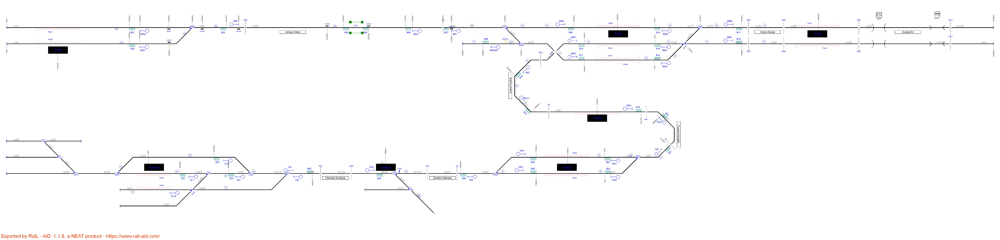
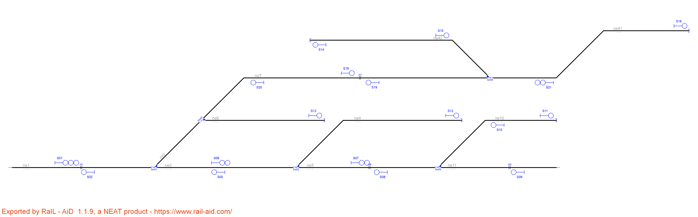
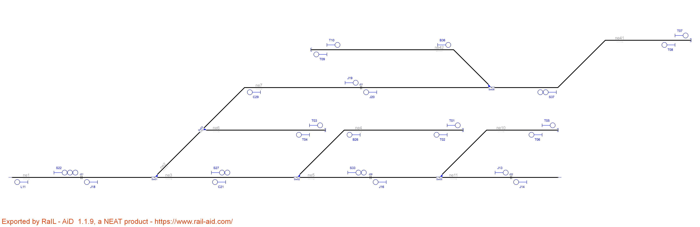
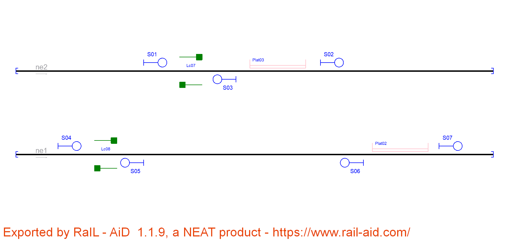
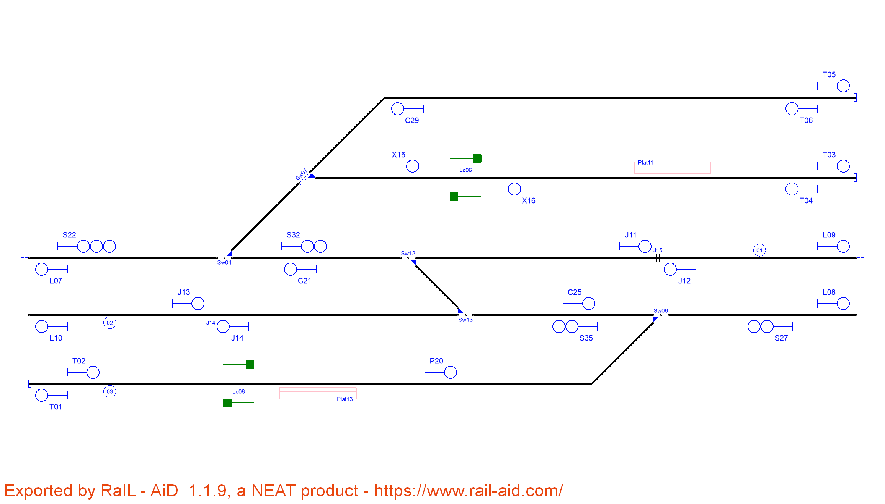

# Example_1
## Name: 

| Route  | Entry | Exit | Switches | Platforms | Crossings | netElements |
|  :---:  |  :---:  |  :---:  |  :---:  |  :---:  |  :---:  |  :---:  |
| R_01 |  S07  |  S11  | Sw01_N  | - | - | ne14-ne16 |
| R_02 |  S08  |  S11  | Sw01_R  | - | - | ne15-ne16 |
| R_03 |  S09  |  S12  | Sw02_N  | - | - | ne18-ne16 |
| R_04 |  S10  |  S13  | Sw03_N  | - | - | ne20-ne19 |
| R_05 |  S10  |  S12  | Sw03_R + Sw02_R  | - | - | ne20-ne17-ne16  |

| Route  | Entry | Exit | Switches | Platforms | Crossings | netElements |
|  :---:  |  :---:  |  :---:  |  :---:  |  :---:  |  :---:  |  :---:  |
| R_01 |  P10  |  S18  | Sw01_N  | - | - | ne14-ne16 |
| R_02 |  B14  |  S18  | Sw01_R  | - | - | ne15-ne16 |
| R_03 |  P11  |  S15  | Sw02_N  | - | - | ne18-ne16 |
| R_04 |  S21  |  T01  | Sw03_N  | - | - | ne20-ne19 |
| R_05 |  S21  |  S15  | Sw03_R + Sw02_R | - | - | ne20-ne17-ne16 |
| R_06 |  S15  |  P09  | Sw01_N  | - | Lc01 | ne16-ne14 |
| R_07 |  S15  |  L04  | Sw01_R  | - | Lc01 | ne16-ne15 |
| R_08 |  S18  |  P12  | Sw02_N  | - | Lc01 | ne16-ne18 |
| R_09 |  T02  |  L06  | SW03_N  | -  | - | ne19-ne20 |
| R_10 |  S18  |  L06  | Sw02_R + Sw03_R  | - | Lc01 | ne16-ne17-ne20 |

Routes 1 to 5 are the same in both interlocking tables, but RNA considers tracks as bidirectional while the original layout has only one direction per track. Routes 6 to 10 are the opposite of routes 1 to 5. It does not affect safety, RNA always considers every possible route in the layout. What is more, departure signal are considered for line borders and buffer stops for extra protection.

# Example_2
## Name: 

| Route  | Entry | Exit | Switches | Platforms | Crossings | netElements |
|  :---:  |  :---:  |  :---:  |  :---:  |  :---:  |  :---:  |  :---:  |
| R_01 | 68N1 | 69Va | 68W02_R | - | Lc01 | 7-9-95 |
| R_02 | 68N2 | 69Va | 68W02_N | - | Lc01 | 1-9-95 |
| R_03 | 69Va | 69A | - | - | - | 95-59 |
| R_04 | 69A | 69N2 | 69W03_N | Plat09 | - | 59-17 |
| R_05 | 69A | 69N3 | Sw03_NN + 69W03_R + 69W04_R | Plat08 + Plat13 | - | 59-11-52-77 |
| R_06 | 69B2 | 69P2 | Sw06_N | Plat09 | - | 78-17 |
| R_07 | 69B2 | 69P3 | Sw06_R + Sw07_RR | Plat13 | - | 78-79-77 |
| R_08 | 69B2 | 69P1 | Sw06_R + Sw07_RN | Plat12 | - | 78-79-21 |
| R_09 | 69C | 69N1 | Sw04_RR | Plat12 | - | 70-104-21 |
| R_10 | 69Vc | 69Vc1 | - | Plat7 | - | 67-70 |
| R_11 | 70Va | 70A | - | - | - | 103-64 |
| R_12 | 70N2 | 69Vc | 70W01_R | - | - | 23-64-103-67 |
| R_13 | 70N1 | 69Vc | 70W0_N | - | - | 24-64-103-67 |
| R_14 | 70B | 70N2 | 70W02_N | Plat05 | - | 26-23 |
| R_15 | 70B | 70N1 | 70W02_R | Plat06 | - | 26-24 |
| R_16 | 70A | 70P1 | 70W01_N | Plat06 | - | 64-24 |
| R_17 | 70A | 70P2 | 70W01_R | Plat05 | - | 64-23 |
| R_18 | 69W04Y | 69N3 | Sw03_NN + 69W04_N | Plat13 | - | 14-52-77 |
| R_19 | 72-1 | S01 | Sw04_N | - | - | 83-32 |
| R_20 | 72-3b | S01 | Sw04_R + Sw05_NR | - | - | 41-82-32 |
| R_21 | 69B1 | 69P3 | Sw07_NR | Plat08 + Plat13 | - | 97-94-77 |
| R_22 | 69P1 | 70Va | Sw03_RR | Plat07 | - | 21-104-70-67-103 |
| R_23 | 69B1 | 69P1 | Sw07_NN | Plat12 | - | 94-21 |
| R_24 | 69P2 | 68F | 69W03_N | - | Lc01 | 17-59-95-9 |
| R_25 | 72-3b | 72B | Sw05_NN + Sw41_R | - | - | 41-85-100 |
| R_26 | 72Va | 72A | - | - | - | 44-104-100 |
| R_27 | 72-2 | 72B | Sw09_R + Sw41_N | - | - | 29-110-100 |
| R_28 | S01 | 72B | Sw09_N + Sw41_N | - | - | 32-110-100 |
| R_29 | 72B | 70B | 71W01_N | - | - | 100-101-44-102-65-26 |
| R_30 | 69P3 | 68F | Sw03_NN + 69W03_R + 6904_R | - | Lc01 | 77-52-11-59-95-9 |
| R_31 | 70P1 | 72Va | 70W02_R + 71W01_N | - | - | 24-26-65-102-44 |
| R_32 | 70P2 | 72Va | 70W02_N + 71W01_N | - | - | 23-26-65-102-44 |
| R_33 | 69Vc1 | 69C | - | - | - | 70 |

| Route  | Entry | Exit | Switches | Platforms | Crossings | netElements |
|  :---:  |  :---:  |  :---:  |  :---:  |  :---:  |  :---:  |  :---:  |
| R_01 |  J43  |  L35  | 68W02_R | - | - | 7-9-95 |
| R_02 |  P53  |  L35  | 68W02_N | - | - | 1-9-95 |
| R_03 |  J48  |  S83  | - | - | Lc01 | 95-59 |
| R_04 |  S83  |  P67  | 69W03_N | Plat09 | - | 59-17 |
| R_05 |  S83  |  P75  | Sw03_NN + 69W03_R + 69W04_R | Plat08 + Plat13 | - | 59-11-52-77 |
| R_06 |  S110  |  P66  | Sw06_N | Plat09 | - | 78-17 |
| R_07 |  S110  |  P74  | Sw06_R + Sw07_RR | Plat08 + Plat13 | - | 78-79-77 |
| R_08 |  S110 |  P72  | Sw06_R + Sw07_NR | Plat12 | - | 78-79-21 |
| R_09 |  L32  |  P73  | Sw03_RR | Plat12 | - | 70-104-21 |
| R_10 |  P64  |  L32  | - | - | - | 67-70 |
| R_11 |  L41  |  S90  | - | - | - | 103-64 |
| R_12 |  B89  |  P64  | 70W01_R | Plat05 | - | 23-64-103-67 |
| R_13 |  P61  |  P64  | 70W01_N | Plat07 | - | 24-64-103-67 |
| R_14 |  S93  |  B89  | 70W02_N | - | - | 26-23 |
| R_15 |  S93  |  B92  | 70W02_R | Plat06 | - | 26-24 |
| R_16 |  S90 |  P62  | 70W01_N | Plat06 | - | 64+24 |
| R_17 |  S90  |  P60  | 70W01_R | Plat05 | - | 64+23 |
| R_18 |  T08  |  P75  | Sw03_NN + 69W04_N | Plat08 + Plat13 | - | 14-52-77 |
| R_19 |  P57  |  C100  | Sw04_N | - | - | 83-32 |
| R_20 |  P59  |  C100  | S04_R + Sw05_NR | - | - | 41-82-32 |
| R_21 |  L37  |  P74  | Sw07_NR | Plat08 + Plat13 | - | 97-94-77 |
| R_22 |  P72  |  L31  | Sw03_RR | - | - | 21-104-70-67 |
| R_23 |  L37  |  P72  | Sw07_NN | Plat12 | - | 97-94-21 |
| R_24 |  P66  |  J49  | 69W03_N | - | - | 17-59-95 |
| R_25 |  P59  |  S105  | Sw05_NN + Sw41_R | - | - | 41-85-100-101-44 |
| R_26 |  L28  |  L40  | - | - | - | 44-104 |
| R_27 |  S97  |  C124  | Sw08_R + Sw09_R | - | - | 30-29-110 |
| R_28 |  C100  |  C124  | Sw09_N | - | - | 32-110 |
| R_29 |  S105  |  S93  | 71W01_N | - | - | 44-102-65-26 |
| R_30 |  S86  |  J49  | 69W03_R + 69W04_R | - | - | 52-11-59-95 |
| R_31 |  J49  |  S80  | - | - | Lc01 | 95-9 |
| R_32 |  P60  |  L27  | 70W02_N | - | - | 23-26 |
| R_33 |  P62  |  L27  | 70W02_R | - | - | 24-26 |
| R_34 |  L27  |  L30  | - | - | - | 26-65 |
| R_35 |  C104  |  L28  | 71W01_N | - | - | 102-44 |
| R_36 |  T02  |  P53  | - | Plat01 | - | 1 |
| R_37 |  T04  |  L42  | - | - | Ucr01 + Ocr01 | 4-106 |
| R_38 |  T06  |  P55  | - | Plat02 | - | 7 |
| R_39 |  T10  |  P59  | - | Plat04 | - | 41 |
| R_40 |  T12  |  L29  | 71W02 | - | - | 47-48 |
| R_41 |  T14  |  S105  | Sw05_RN + Sw41_R | - | - | 84-85-100-101-44 |
| R_42 |  T14  |  C100  | Sw04_R + Sw05_RR | - | - | 84-83-32 |
| R_43 |  T18  |  T15  | Sw11_N | - | - | 88-86 |
| R_44 |  T20  |  S97  | Sw12_N | - | - | 89-30 |
| R_45 |  T22  |  S97  | Sw12_R + Sw13_R | - | - | 90-91-30 |
| R_46 |  T24  |  P70  | - | Plat11 | Ucr01 + Ocr01 | 105-98-96 |
| R_47 |  L30  |  C104  | - | - | - | 65-102 |
| R_48 |  L31  |  P65  | - | Plat07 | - | 67 |
| R_49 |  L33  |  L34  | - | - | - | 78-93 |
| R_50 |  L34  |  L38  | - | Plat11 | - | 96-98 |
| R_51 |  L35  |  J48  | - | - | - | 95 |
| R_52 |  L38  |  T23  | - | - | Ucr01 + Ocr01 | 98-105 |
| R_53 |  L40  |  S126  | - | - | - | 101-100 |
| R_54 |  L42  |  L37  | - | Plat10 | - | 108-99-97 |
| R_55 |  P55  |  J43  | - | - | - | 7 |
| R_56 |  P56  |  S119  | Sw08_N | - | - | 83-30 |
| R_57 |  P65  |  L41  | - | - | - | 67-103-64 |
| R_58 |  P67  |  L33  | Sw06_N | - | - | 17-78 |
| R_59 |  P69  |  T03  | - | - | Ucr01 + Ocr01 | 90-106-4 |
| R_60 |  P70  |  S110  | - | - | - | 96-93-78 |
| R_61 |  P73  |  P69  | Sw07_NN | Plat10 | - | 21-94-97-99 |
| R_62 |  P73  |  L33  | Sw07_NR | - | - | 21-79-78 |
| R_63 |  P74  |  S86  | Sw03_NN | - | - | 77-52 |
| R_64 |  P75  |  P69  | Sw07_RN | - | - | 77-94-97-99 |
| R_65 |  P75  |  L33  | Sw06_R + Sw07_RR | - | - | 77-79-78 |
| R_66 |  B92  |  P61  | - | - | - | 24 |
| R_67 |  B96  |  S119  | Sw08_R | - | - | 29-30 |
| R_68 |  B101  |  B96  | - | - | - | 29 |
| R_69 |  C124  |  S105  | Sw41_N | - | - | 110-100-101-44 |
| R_70 |  B125  |  T09  | Sw05_NN | Plat04 | - | 85-41 |
| R_71 |  B125  |  T13  | Sw05_RN | - | - | 85-84 |
| R_72 |  S80  |  T01  | 68W02_n | Plat01 | - | 9-1 |
| R_73 |  S80  |  T05  | 68W02_R | Plat02 | - | 9-7 |
| R_74 |  S86  |  T07  | 69W04_N | - | - | 52-14 |
| R_75 |  S105 |  L29  | 71W01_R + 71W02_N | - | - | 44-43-48 |
| R_76 |  S126  |  S102  | Sw41_N | - | - | 100-110 |
| R_77 |  S126  |  B125 | Sw41_R | - | - | 100-85 |
| R_78 |  S102  |  S113  | Sw09_N | - | - | 110-32 |
| R_79 |  S102  |  B101  | Sw09_R | - | - | 110-29 |
| R_80 |  S113  |  P56  | Sw04_N | Plat03 | - | 32-83 |
| R_81 |  S113  |  T09  | Sw04_R + Sw05_NR | Plat04 | - | 32-82-41 |
| R_82 |  S113  |  T13  | Sw04_R + Sw05_RR | - | - | 32-82-84 |
| R_83 |  S119  |  T19  | Sw012_N | - | - | 30-89 |
| R_84 |  S119  |  T15  | Sw11_R + Sw12_R + Sw13_N | - | - | 30-91-87-86 |
| R_85 |  S119  |  T21 | Sw12_R + Sw13_R | - | - | 30-91-90 |
| R_86 |  S97  |  P57  | Sw08_N | Plat03 | - | 30-83 |
| R_87 |  T16  |  T17  | Sw11_N | - | - | 86-88 |
| R_88 |  T16  |  S97  | Sw11_R + Sw12_R + Sw13_N | - | - | 86-87-91-30 |

Routes 1 to 29 are equivalent in both interlocking tables.

Route 30 in the original signalling is splitted in route 30 and 31 by the RNA

Route 31 and 32 in the original signalling is splitted in routes 32/34/35 and 33/34/35 respectively.

Route 33 in the orignal signallins is integrated in Routes 9, 10 and 22 by the RNA.

Routes 34 to 88 are created considering all the signals generated to protect buffer stops, line borders and curves, and to considering bidirectional tracks. Disabling these functionalities both interlocking tables are equivalent without any other difference between them.

# Example_3
## Name:

# Example_4
## Name:

| Route  | Entry | Exit | Switches | Platforms | Crossings | netElements |
|  :---:  |  :---:  |  :---:  |  :---:  |  :---:  |  :---:  |  :---:  |
| R_01 |  S01  |  S06  | Sw01_N  | - | - | ne01-ne02 |
| R_02 |  S05  |  S13  | Sw01_N  | - | - | ne02-ne01 |
| R_03 |  S01  |  S03  | Sw01_R  | - | - | ne01-ne03 |
| R_04 |  S04  |  S13  | Sw01_R  | - | - | ne03-ne01 |
| R_05 |  S02  |  S04  | Sw02_R  | - | - | ne04-ne02 |
| R_06 |  S06  |  S15  | Sw02_N  | - | - | ne02-ne04 |
| R_07 |  S02  |  S05  | Sw02_N  | - | - | ne04-ne03 |
| R_08 |  S03  |  S15  | Sw02_R  | - | - | ne03-ne04 |
| R_09 |  S07  |  S11  | Sw03_N  | - | - | ne05-ne06 |
| R_10 |  S10  |  S14  | Sw03_N  | - | - | ne06-ne05 |
| R_11 |  S07  |  S09  | Sw03_R  | - | - | ne05-ne07 |
| R_12 |  S08  |  S14  | Sw03_R  | - | - | ne07-ne05 |
| R_13 |  S12  |  S10  | Sw04_N  | - | - | ne08-ne06 |
| R_14 |  S11  |  S16  | Sw04_N  | - | - | ne06-ne08 |
| R_15 |  S12  |  S08  | Sw04_R  | - | - | ne08-ne07 |
| R_16 |  S09  |  S16  | Sw04_R  | - | - | ne07-ne08 |

| Route  | Entry | Exit | Switches | Platforms | Crossings | netElements |
|  :---:  |  :---:  |  :---:  |  :---:  |  :---:  |  :---:  |  :---:  |
| R_01 |  S23  |  C25  | Sw01_N | - | - | ne01-ne02 |
| R_02 |  C21  |  T01  | Sw01_N | - | - | ne02-ne01 |
| R_03 |  S23  |  J11  | Sw01_R | - | - | ne01-ne03 |
| R_04 |  J12  |  T01  | Sw01_R | - | - | ne03-ne01 |
| R_05 |  S27  |  C21  | Sw02_N | - | - | ne04-ne02 |
| R_06 |  C25  |  T03  | Sw02_N | - | - | ne02-ne04 |
| R_07 |  S27  |  J12  | Sw02_R | - | - | ne04-ne03 |
| R_08 |  J11  |  T04  | Sw02_R | - | - | ne03-ne04 |
| R_09 |  S31  |  C33  | Sw03_N | - | - | ne05-ne06 |
| R_10 |  C29  |  T05  | Sw03_N | - | - | ne06-ne05 |
| R_11 |  S31  |  J17  | Sw03_R | - | - | ne05-ne07 |
| R_12 |  J18  |  T05  | Sw03_R | - | - | ne07-ne05 |
| R_13 |  S35  |  C29  | Sw04_N | - | - | ne08-ne06 |
| R_14 |  C33  |  T07  | Sw04_N | - | - | ne06-ne08 |
| R_15 |  S35  |  J18  | Sw04_R | - | - | ne08-ne07 |
| R_16 |  J17  |  T07  | Sw04_R | - | - | ne07-ne08 |
| R_17 |  T02  |  S23  | - | - | - | ne01 |
| R_18 |  T04  |  S27  | - | - | - | ne04 |
| R_19 |  T06  |  S31  | - | - | - | ne05 |
| R_20 |  T08  |  S35  | - | - | - | ne08 |

Routes 1 to 16 are the same in both interlocking tables, but RNA considers a departure signal is necessary close to buffer stops to allow trains to start moving. This authority could be delegated on signals S23,S31,S27 and S35 but they are far away their respective buffer stops. This extra four signals add four more routes to move the train from each buffer stop prior to every switch. It does not affect safety but it adds an extra step before a critical action, increasing safety.

# Example_5

| Route  | Entry | Exit | Switches | Platforms | Crossings | netElements |
|  :---:  |  :---:  |  :---:  |  :---:  |  :---:  |  :---:  |  :---:  |
| R_01 | S01 | S06 | Sw01_N | - | - | ne01-ne03 |
| R_02 | S01 | S13 | Sw01_R + Sw03_R | - | - | ne01-ne02-ne06 |
| R_03 | S01 | S18 | Sw01_R + Sw03_N | - | - | ne01-ne02-ne07 |
| R_04 | S06 | S07 | Sw02_N | - | - | ne03-ne05 |
| R_05 | S06 | S12 | Sw02_R | - | - | ne03-ne04 |
| R_06 | S21 | S19 | Sw08_N | - | - | ne41-ne07 |
| R_07 | S21 | S14 | Sw08_R | - | - | ne41-ne42 |
| R_08 | S05 | S02 | Sw01_N | - | - | ne03-ne01 |
| R_09 | S09 | S08 | Sw05_N | - | - | ne11-ne05 |
| R_10 | S08 | S05 | Sw02_N | - | - | ne05-ne03 |
| R_11 | S10 | S08 | Sw05_R | - | - | ne10-ne05 |
| R_12 | S15 | S16 | Sw08_R | - | - | ne42-ne41 |
| R_13 | S18 | S16 | Sw08_N | - | - | ne07-ne41 |
| R_14 | S19 | S20 | - | - | - | ne07 |
| R_15 | S20 | S02 | Sw01_R + Sw03_N | - | - | ne07-ne02-ne01 |
| R_16 | S07 | S11 | Sw05_R | - | - | ne05-ne10 |

| Route  | Entry | Exit | Switches | Platforms | Crossings | netElements |
|  :---:  |  :---:  |  :---:  |  :---:  |  :---:  |  :---:  |  :---:  |
| R_01 | S22 | S27 | Sw01_N | - | - | ne01-ne03 |
| R_02 | S22 | T03 | Sw01_R + Sw03_R | - | - | ne01-ne02-ne06 |
| R_03 | S22 | J19 | Sw01_R + Sw03_N | - | - | ne01-ne02-ne07 |
| R_04 | S27 | S22 | Sw02_N | - | - | ne03-ne05 |
| R_05 | S27 | T01 | Sw02_R | - | - | ne03-ne04 |
| R_06 | S37 | J20 | Sw08_N | - | - | ne41-ne07 |
| R_07 | S37 | T09 | Sw08_R | - | - | ne41-ne42 |
| R_08 | C21 | J18 | Sw01_N | - | - | ne03-ne01 |
| R_09 | J14 | J16 | Sw05_N | - | - | ne11-ne05 |
| R_10 | J16 | C21 | Sw02_N | - | - | ne05-ne03 |
| R_11 | T06 | J16 | Sw05_R | - | - | ne10-ne05 |
| R_12 | B36 | T07 | Sw08_R | - | - | ne42-ne41 |
| R_13 | J19 | T07 | Sw08_N | - | - | ne07-ne41 |
| R_14 | J20 | C29 | - | - | - | ne07 |
| R_15 | C29 | J18 | Sw01_R + Sw03_N | - | - | ne07-ne02-ne01 |
| R_16 | S33 | T05 | Sw05_R | - | - | ne05-ne10 |
| R_17 | S33 | J13 | Sw05_N | - | - | ne05-ne11 |
| R_18 | T04 | J18 | Sw01_R + Sw03_R | - | - | ne06-ne02-ne01 |
| R_19 | B26 | C21 | Sw02_R | - | - | ne04-ne03 |
| R_20 | T02 | B26 | - | - | - | ne04 |
| R_21 | T08 | S37 | - | - | - | ne41 |
| R_22 | T10 | B36 | - | - | - | ne42 |
| R_23 | J18 | L11 | - | - | - | ne01 |

Routes 1 to 16 are equivalent in both interlocking tables.

The RNA adds departure signlas T02, T08 and T10, creating new routes 20,21 and 22 used to insert back trains in the main line.

Routes 17, 18, 19 and 23 use new signals added by the RNA, necessary to improve mobility.

With these changes it is possible to cover all the layout in any direction without any restriction.

# Example_6

| Route  | Entry | Exit | Switches | Platforms | Crossings | netElements |
|  :---:  |  :---:  |  :---:  |  :---:  |  :---:  |  :---:  |  :---:  |
| R_01 |  S01  |  S02  | Sw18_N | - | - | ne01-ne41 |
| R_02 |  S01  |  S06  | Sw14_N + Sw18_R | - | - | ne01-ne40-ne32 |
| R_03 |  S01  |  S07  | Sw14_R + Sw18_R | - | - | ne01-ne40-ne31 |
| R_04 |  S03  |  S09  | Sw19_N | - | - | ne42-ne43 |
| R_05 |  S03  |  S10  | Sw18_N + Sw19_R | - | - | ne42-ne41-ne01 |
| R_06 |  S02  |  S08  | Sw19_R | - | - | ne41-ne42 |
| R_07 |  S04  |  S10  | Sw14_R + Sw18_R | - | - | ne31-ne40-ne01 |
| R_08 |  S05  |  S10  | Sw14_N + Sw18_R | - | - | ne32-ne40-ne01 |

| Route  | Entry | Exit | Switches | Platforms | Crossings | netElements |
|  :---:  |  :---:  |  :---:  |  :---:  |  :---:  |  :---:  |  :---:  |
| R_01 |  S14  |  B18  | Sw18_N | - | - | ne01-ne41 |
| R_02 |  S14  |  T05  | Sw14_N + Sw18_R | - | - | ne01-ne40-ne32 |
| R_03 |  S14  |  T03  | Sw14_R + Sw18_R | - | - | ne01-ne40-ne31 |
| R_04 |  S19  |  T09  | Sw19_N | - | - | ne42-ne43 |
| R_05 |  S19  |  T01  | Sw18_N + Sw19_R | - | - | ne42-ne41-ne01 |
| R_06 |  B18  |  T07  | Sw19_R | - | - | ne41-ne42 |
| R_07 |  T04  |  T01  | Sw14_R + Sw18_R | - | - | ne31-ne40-ne01 |
| R_08 |  C11  |  T01  | Sw14_N + Sw18_R | - | - | ne32-ne40-ne01 |
| R_09 |  T02  |  S14  | - | - | - | ne01 |
| R_10 |  T06  |  C11  | - | - | - | ne32 |
| R_11 |  T08  |  S19  | - | - | - | ne42 |
| R_12 |  T10  |  T07  | Sw19_N | - | - | ne43-ne42 |

Routes 1 to 8 are equivalente in both interlocking tables.

The RNA adds departure signal T02, T06, T08 and T10 to protect buffer stops. Signals T02, T06 and T08 are used to allow stopped trains to move close to the main signals S14, S19 and C11. signal T04 is used to insert trains back to the main line. These extra signals increase safety by protecting the buffer stops, mandatory in many countries. If the buffer stops are configured to not be protected then both interlocking tables are the same.

# Example_7

| Route  | Entry | Exit | Switches | Platforms | Crossings | netElements |
|  :---:  |  :---:  |  :---:  |  :---:  |  :---:  |  :---:  |  :---:  |
| R_01 |  S01  |  S02  | - | Plat03 | Lc07 | ne02 |
| R_02 |  S04  |  S07  | - | Plat02 | Lc08 | ne01 |
| R_03 |  S06  |  S05  | - | Plat02 | Lc08 | ne01 |

| Route  | Entry | Exit | Switches | Platforms | Crossings | netElements |
|  :---:  |  :---:  |  :---:  |  :---:  |  :---:  |  :---:  |  :---:  |
| R_01 |  X09  |  P16  | - | Plat03 | Lc07 | ne02 |
| R_02 |  T02  |  T03  | - | Plat02 | Lc08 | ne01 |
| R_03 |  T08  |  X10  | - | Plat03 | - | ne02 |
| R_04 |  X10  |  T05  | - | - | Lc07 | ne02 |
| R_05 |  T04  |  P13  | - | Plat02 | - | ne01 |
| R_06 |  X12  |  T01  | - | - | Lc08 | ne02 |
| R_07 |  T06  |  X09  | - | - | - | ne02 |
| R_08 |  P13  |  X12  | - | - | - | ne02 |
| R_09 |  P16  |  T07  | - | - | - | ne01 |

Routes 1 to 3 in the original layout are equivalent to routes 1 and 2 in the new signalling. 

Routes 3 to 4 in the new signalling are equivalent to route 1 in the original signalling but with a stop between the platform and the level crossing and in the opposite direction.

Routes 5 to 6 in the new signalling include a stop between the level crossing and the platform. They can be consider as equivalents to route 3 in the original signalling or to route 2 with an opposite direction.

Route 7 is used to approach carefully the level crossing.
Route 8 is used as a departure signal from the platform to move up to the level crossing
Route 9 is added as a departure signal tot stop before the end of the line. The original layout had no stop signals prior buffer stops.

# Example_8

# Example_9

| Route  | Entry | Exit | Switches | Platforms | Crossings | netElements |
|  :---:  |  :---:  |  :---:  |  :---:  |  :---:  |  :---:  |  :---:  |
| R_01 | S03 | S04 | - | - | - | ne26 |
| R_02 | S04 | S05 | - | - | - | ne26 |
| R_03 | S05 | S06 | - | - | - | ne26 |
| R_04 | S06 | S07 | - | - | - | ne26 |
| R_05 | S07 | S08 | - | - | - | ne26 |
| R_06 | S08 | S09 | Sw12_N | - | - | ne26-ne03 |
| R_07 | S52 | S53 | - | - | - | ne25 |
| R_08 | S53 | S54 | Sw11_N | - | - | ne25-ne23 |
| R_09 | S54 | S55 | - | - | - | ne23 |
| R_10 | S55 | S56 | - | - | - | ne23 |
| R_11 | S56 | S58 | - | - | - | ne23 |
| R_12 | S58 | S57 | - | - | - | ne23 |
| R_13 | S59 | S09 | Sw11_R + Sw12_R | - | - | ne23-ne27-ne03 |
| R_14 | S36 | S54 | Sw11_R + Sw12_R | - | - | ne03-ne27-ne23 |

| Route  | Entry | Exit | Switches | Platforms | Crossings | netElements |
|  :---:  |  :---:  |  :---:  |  :---:  |  :---:  |  :---:  |  :---:  |
| R_01 | J07 | J09 | - | - | - | ne26 |
| R_02 | J09 | J11 | - | - | - | ne26 |
| R_03 | J11 | J13 | - | - | - | ne26 |
| R_04 | J13 | J15 | - | - | - | ne26 |
| R_05 | J15 | J17 | Sw12_N | - | - | ne26-ne03 |
| R_06 | J17 | L05 | - | - | - | ne03 |
| R_07 | T04 | J32 | - | - | - | ne25 |
| R_08 | J32 | J30 | Sw11_N | - | - | ne25-ne23 |
| R_09 | J30 | J28 | - | - | - | ne23 |
| R_10 | J28 | J26 | - | - | - | ne23 |
| R_11 | J26 | J24 | - | - | - | ne23 |
| R_12 | J24 | J22 | - | - | - | ne23 |
| R_13 | J22 | T01 | - | - | - | ne23 |
| R_14 | S36 | J17 | Sw11_R + Sw12_R | - | - | ne23-ne27-ne03 |
| R_15 | S39 | J30 | Sw11_R + Sw12_R | - | - | ne03-ne27-ne23 |
| R_16 | J20 | S39 | - | - | - | ne03 |
| R_17 | S39 | J16 | Sw12_N | - | - | ne03-ne26 |
| R_18 | J16 | J14 | - | - | - | ne26 |
| R_19 | J14 | J12 | - | - | - | ne26 |
| R_20 | J12 | J10 | - | - | - | ne26 |
| R_21 | J10 | L06 | - | - | - | ne26 |
| R_22 | T02 | J23 | - | - | - | ne23 |
| R_23 | J23 | J25 | - | - | - | ne23 |
| R_24 | J25 | J27 | - | - | - | ne23 |
| R_25 | J27 | S36 | - | - | - | ne23 |
| R_26 | S36 | J31 | Sw11_N | - | - | ne23-ne25 |
| R_27 | J31 | J33 | - | - | - | ne25 |
| R_28 | J33 | T03 | - | - | - | ne25|

Routes 1 to 6 are equivalent in both interlocking tables. However, because the original layout introduce signals at the beginning of every track while RNA introduces signals prior every danger, there are 6 signals before switch 12 and 1 signal after it in the original signalling but 5 and 2 in the new signalling generated by the RNA respectively. The original signalling needs 5 routes to reach the switch and 1 to cross it, while RNA creates 4 routes to reach the switch, 1 to cross it and 1 extra for moving further.

Routes 7 to 12 are equivalent to routes 7 to 13 in the new signalling. The extra route corresponds to the signal protecting the buffer stop, which introduces a new route.

Routes 13 and 14 are equivalent to routes 14 and 15.

Routes 16 to 28 are equivalente to routes 1 to 12 but in the opposite direction. If we consider only one-way tracks then these routes are ignored, obtaining the same interlocking table both in the original signalling and by RNA.

# Example_10

| Route  | Entry | Exit | Switches | Platforms | Crossings | netElements |
|  :---:  |  :---:  |  :---:  |  :---:  |  :---:  |  :---:  |  :---:  |
| R_01 |  S01  |  S17  | Sw04_N | - | - | ne01-ne08 |
| R_02 |  S01  |  S19  | Sw04_R + Sw07_N | - | - | ne01-ne09-ne15 |
| R_03 |  S01  |  S05  | Sw04_R + Sw07_R | - | - | ne01-ne09-ne14 |
| R_04 |  S17  |  S15  | Sw12_N | - | - | ne08-ne22 |
| R_05 |  S16  |  S02  | Sw12_N | - | - | ne22-ne08 |
| R_06 |  S17  |  S12  | Sw12_R + Sw13_R | - | - | ne08-ne24-ne12 |
| R_07 |  S10  |  S02  | Sw12_R + Sw13_R | - | - | ne12-ne24-ne08 |
| R_08 |  S10  |  S14  | Sw13_N | - | - | ne12-ne23 |
| R_09 |  S13  |  S12  | Sw13_N | - | - | ne23-ne12 |
| R_10 |  S07  |  S10  | Sw06_N | - | - | ne02-ne12 |
| R_11 |  S07  |  S09  | Sw06_R | Plat13 | Lc08 | ne02-ne13 |
| R_12 |  S05  |  S06  | - | Plat11 | Lc06 | ne14 |
| R_13 |  S06  |  S20  | - | - | - | ne14 |
| R_14 |  S09  |  S18  | - | - | - | ne13 |

| Route  | Entry | Exit | Switches | Platforms | Crossings | netElements |
|  :---:  |  :---:  |  :---:  |  :---:  |  :---:  |  :---:  |  :---:  |
| R_01 |  S22  |  S32  | Sw04_N  | - | - | ne01-ne08 |
| R_02 |  S22  |  T05  | Sw04_R + Sw07_N | - | - | ne01-ne09-ne15 |
| R_03 |  S32  |  X15  | Sw04_R + Sw07_R | - | - | ne01-ne09-ne14 |
| R_04 |  S32  |  J11  | Sw12_N | - | - | ne08-ne22 |
| R_05 |  J12  |  C21  | Sw12_N | - | - | ne22-ne08 |
| R_06 |  S32  |  C25  | Sw12_R + Sw13_R | - | - | ne08-ne24-ne12 |
| R_07 |  S35  |  C21  | Sw12_R + Sw13_R | - | - | ne12-ne24-ne08 |
| R_08 |  S35  |  J14  | Sw13_N | - | - | ne12-ne23 |
| R_09 |  J13  |  C25  | Sw13_N | - | - | ne23-ne12 |
| R_10 |  S27  |  S35  | Sw06_N | - | - | ne02-ne12 |
| R_11 |  S27  |  T01  | Sw06_R | Plat13 | Lc08 | ne02-ne13 |
| R_12 |  X15  |  T03  | - | Plat11 | Lc06 | ne14 |
| R_13 |  T04  |  X16  | - | Plat11 | - | ne14 |
| R_14 |  T02  |  P20  | - | Plat13 | Lc08 | ne13 |
| R_15 |  T06  |  C29  | - | - | - | ne15 |
| R_16 |  J11  |  L09  | - | - | - | ne22 |
| R_17 |  J14  |  L10  | - | - | - | ne23 |
| R_18 |  X16  |  L07  | Sw04_R + Sw07_R | - | Lc06 | ne14-ne09-ne01 |
| R_19 |  C29  |  L07  | Sw04_N + Sw07_R | - | - | ne15-ne09-ne01 |
| R_20 |  C21  |  L07  | Sw04_N  | - | - | ne08-ne01 |
| R_21 |  P20  |  L08  | Sw06_R  | - | - | ne13-ne02 |
| R_22 |  C25  |  L08  | Sw06_N  | - | - | nex12-ne02 |

Routes 1 to 11 are the same in both interlocking tables.

Routes 12 and 13 in the original interlocking table were combined in Route Routet 12 because signals S06 and S20 were replaced by T03 due to proximity.

Route 14 was deleted because signal S09 was very close S18 and, therefore, unuseful as signal. Routes 11 and 14 in the original signalling were combined in Route 11 in the new signalling.

Routes 15 to 22 are created because RNA added signals T01,T02,T03,T04,T05 and T06 to protectt buffer stops and signals L07,L08,L09 and L10 to protect line borders. These new signals created new routes to stop prior the (relative or absolute) end of the network, increasing safety, and to add opposite routes than the originals, increasing mobility.

